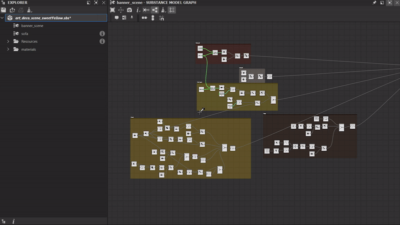

# バージョン 12.4

**Substance 3D Designer 12.4**&#x200B;では、生活の質がいくつか向上しています（基本的な数式を使用してパラメーターを設定し、グラフをクリーンアップするツール、ランダムシードを生成するボタン、サイズのロックなど）。 Python APIでのSubstanceモデルグラフのサポート。 これらの変更について詳しくは、以下を参照してください。

リリース日： *2023年1月31日*

## QOLの改善

### グラフの削除ツール

グラフを編集する際には、いくつかの方法を試してみたり、目的の結果が得られるまで様々なノードを接続または抜いたりする必要がある場合があります。 グラフの最後には、出力にコネクトされていないノードがあるため、最終結果に影響を与えません。 この新しいツールを使用すると、それらのノードを自動的に検出して削除し、グラフをファイナライズする前にクリーンアップできます。 クリーニングツールはオプションでパラメータ機能を調べることもでき、グラフビューのツールバーにある専用のボタンを使用して現在のグラフ上で起動したり、エクスプローラビューから選択したグラフ上で起動したりできます。

{width="640px"}

### パラメーターフィールドに数式を入力する

特定のパラメータ値を入力する場合は、計算ツールを使用したり、頭の中で計算したりする必要がなくなりました。 アプリケーションのプロパティやその他の場所でパラメーターの数値を設定する際に、加算、除算、乗算、減算などの基本的な数式を直接入力できるようになりました。

{width="640px"}

### 3Dビューのクイックアクセスボタン

[3Dビュー](../../interface/3d-view/3d-view.md)には、[ディスプレイ](../../interface/3d-view/3d-view.md)メニューで利用できるすべてのオプションに対応するツールバーが追加され、これらすべてのオプション（ワイヤーフレーム、グリッド、バウンディングボックスなど）にすばやくアクセスできるようになりました ボタンの切り替え また、環境マップの表示/非表示を切り替えるトグルも追加しました。

{width="640px"}

### ランダムシードを生成するボタン

スライダーを移動する代わりに、新しいボタンを使用してグラフのランダムシードを生成することで、様々なバリエーションをすばやく作成できるようになりました。

{width="640px"}

### 出力サイズウィジェットのロック

出力サイズの幅とHeightを固定して、正方形のサイズを維持できるようにし、2つの値を更新するたびに操作しないようにできるようになりました。

{width="640px"}

### 画像入力をカラー/グレースケールに変換

ノードのコンテキストメニューで[Input Color](../../compositing-graphs/nodes-reference-for-com/atomic-nodes/input/input.md)と[Input Greyscale](../../compositing-graphs/nodes-reference-for-com/atomic-nodes/input/input.md)をすばやく切り替えます。

{width="640px"}

### グラデーションエディターを表示するときにクリックしたピンを選択

プロパティパネルで、ピンをクリックしてグラデーションを編集すると、表示されている[グラデーションエディター](../../compositing-graphs/nodes-reference-for-com/atomic-nodes/gradient-map/gradient-map.md)で対応するピンが自動的に選択されます。

{width="640px"}

### 下流ノードを選択

選択したノードの出力に接続されているすべてのノードを直接または間接的に選択するための[ノードコンテキストメニュー](../../interface/the-graph-view/the-graph-view.md)の新しいエントリです。 そのため、ノードの影響を受けるすべてのノードを選択します。 グラフの一部を削除したり、グラフレイアウトを再調整したりする場合に便利です。

{width="640px"}

## Python APIアップデート

このバージョン12.4では、Python APIを介してSubstanceモデルグラフを完全にサポートしています。 つまり、Substanceモデルグラフを作成、編集、または評価するために必要なすべてのツールを使用できるようになりました。 詳細については、ソフトウェアヘルプメニューから利用可能なドキュメントを参照してください。

## リリースノート

### 12.4.0

*（2023年1月24日公開）*

<b>追加：</b>

* [3Dビュー]表示オプション（ワイヤーフレーム、Environment Map、シーン統計など）を設定するクイックアクセスボタンを追加します。
* [カラーマネジメント] ACEモードでベイク処理された3D LUTの品質を改善します
* [ドキュメント]Substanceグラフのサンプルプロジェクト
* [ドキュメント]関数グラフのサンプルプロジェクト
* [Explorer]ウィジェットを閉じたり無効にしたりすることなく、一方の親から他方の親にグラフおよびリソースを移動できるようにする
* [グラデーションエディター]グラデーションエディターを表示するときに、クリックしたピンを選択
* [グラフ]ノードのコンテキストメニューに、すべての子を選択するオプションを追加する
* [グラフ]すべてのグラフタイプおよびプロパティグラフで未使用のノードを検出して削除する新規グラフツール
* [グラフ]画像入力をカラー/グレースケールに変換
* [パラメータ] integer2ウィジェットにロックを追加する
* [パラメータ]パラメータとして基本的な数式を入力できます
* [Substanceモデル]値ノードの値とアイコンを切り替えるには
* [UI]ランダムシードが必要な場合にランダム値を生成するボタン
* [UI] Scene Browserで現在選択されている項目を3Dビューでハイライト表示
* [UX]値がリセットされたときにスライダー範囲をリセットする
* [API]グラフビューツールバーへのアクションの追加を許可する
* [API] APIからSubstanceモデルグラフを作成、編集、評価できるようにします

<b>修正済み：</b>

* [3Dビュー] &#39;DirectX法線&#39;プロパティ値がレンダラー間で共有されません
* [3Dビュー]ビューポートが小さい場合、シーンの統計表示が引き伸ばされる
* [3Dビュー] ワイヤーフレーム表示プロパティが保存されない
* [コンテンツ] [放射状ブラー]カラーパラメータはアルファチャンネルには影響しません
* [ローカリゼーション]環境のOpenGLプロパティに、追加のスライダーおよびボタンが表示されます。
* [MDL]&#x200B;[Substanceモデル]公開されたノードを削除するとクラッシュする
* [環境設定]削除してもデフォルトの\_configファイルが再作成されない
* [Substanceモデル]インスタンスレベルで表示されないパラメーターの並べ替えがクラッシュする
* [API] SDProperty.getDefaultValue()は、ほとんどの場合Noneを返します
