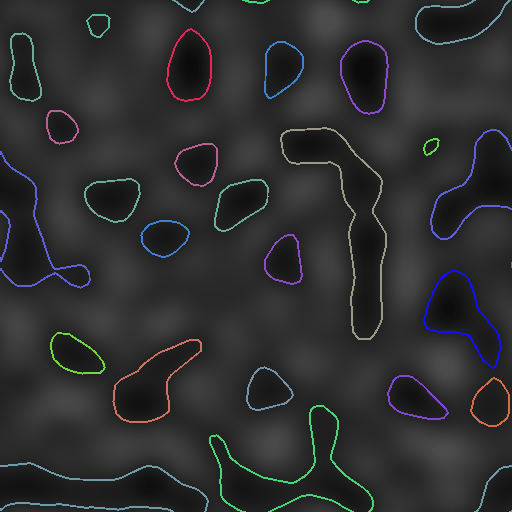
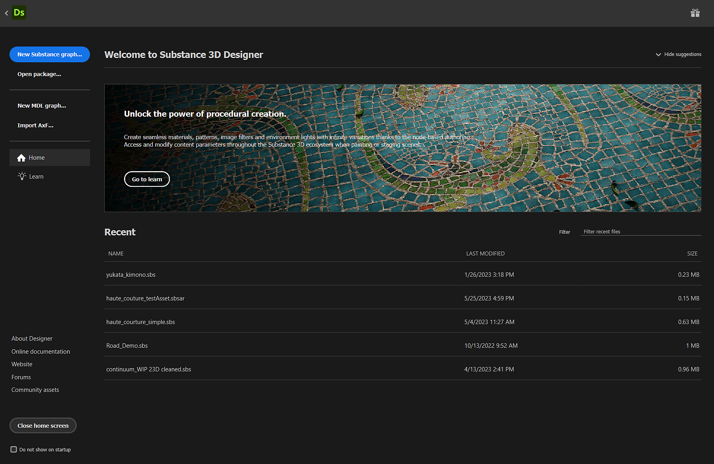

# バージョン 13.0

Substance 3D Designerのこの13.0.0リリースは、大量の新しいノードを備えたマテリアルアーティストに大きな愛を与え、Substance engine 9.0は初めてループを導入し、グラフであるポータルノードに大きく追加されました。 また、より多くのユーザーにご満足いただけるよう、新しいホーム画面を導入し、追加の言語を提供しています。

以前のバージョンで説明したように、このバージョンではSubstanceモデルグラフはサポートされなくなりました。つまり、Designerでグラフを開いたり、編集したり、書き出したりできなくなりました。 この決定を下した理由は、コミュニティフォーラムのこの[投稿](https://community.adobe.com/t5/substance-3d-designer-discussions/substance-model-graphs-end-of-life/td-p/13693731)で確認できます。

*リリース日：2023年6月6日*

*[Celine Dameron](https://www.artstation.com/cline)によるアートワーク*

## 新規コンテンツ

この13.0バージョンには、多くの新しいコンテンツが追加されています。 主に、スプラインツールとパスツールの2つの新しいノードのコレクションが表示されます。

* [スプラインツール](../../compositing-graphs/nodes-reference-for-com/node-library/spline-paths-tools/spline-tools/spline-tools.md)は、スプラインを生成および調整したり、イメージのマッピング、スキャッタリング、またはワープに使用するためのノードの集まりです。
* [パスツール](../../compositing-graphs/nodes-reference-for-com/node-library/spline-paths-tools/path-tools/path-tools.md)は、セグメントのリストの形でマスクから輪郭を抽出し、編集および改善するための別のノードのセットです。

これらすべてのノードは、多くの可能性を提供し、彼らは確かに多くの創造的なアプリケーションを持つことになります。 このツールセットを使いやすくするために、理解すべき重要な概念のツアーについては、[パスとスプラインツールの操作](../../compositing-graphs/nodes-reference-for-com/node-library/spline-paths-tools/working-with-path-and-spl/working-with-path-and-spline-tools.md)に関するセクションを参照してください。

[Louise Melin](https://www.artstation.com/troglodette)*による*&#x200B;アートワーク

### スプラインツール

スプライン専用の新しいノードは、次の4つのカテゴリに分類できます。

#### 作成

最初のカテゴリは、スプラインを生成するカテゴリです。

* [スプライン3次](../../compositing-graphs/nodes-reference-for-com/node-library/spline-paths-tools/spline-tools/spline-cubic/spline-cubic.md): 2点と2接線から；
* [スプラインポリゴン二次](../../compositing-graphs/nodes-reference-for-com/node-library/spline-paths-tools/spline-tools/spline-poly-quadratic/spline-poly-quadratic.md)：一連の点から；
* [スプラインの円](../../compositing-graphs/nodes-reference-for-com/node-library/spline-paths-tools/spline-tools/spline-circle/spline-circle.md)：円形のシェイプに沿っています。

また、[2スプライン](../../compositing-graphs/nodes-reference-for-com/node-library/spline-paths-tools/spline-tools/spline-bridge-2-splines/spline-bridge-2-splines.md)または[Nスプライン](../../compositing-graphs/nodes-reference-for-com/node-library/spline-paths-tools/spline-tools/spline-bridge-list/spline-bridge-list.md)のスプラインの完全なセットを持つスプライン間に、<b>ブリッジ</b>を作成することもできます。

<table>
<tr style="border: 0;">
<td style="border: 0;" valign="top">

</td>
<td style="border: 0;" valign="top">

</td>
<td style="border: 0;" valign="top">

</td>
<td style="border: 0;" valign="top">

</td>
</tr>
</table>

#### 組み立て

場合によっては、複数のスプラインを1つのエンティティとして扱う必要があるので、スプラインのセットを管理するためのツールが必要になります。 [スプライン結合リスト](../../compositing-graphs/nodes-reference-for-com/node-library/spline-paths-tools/spline-tools/spline-merge-list/spline-merge-list.md)では、四肢を順番に接続することにより、すべてのスプラインを単一のスプラインに結合できます。[スプライン追加](../../compositing-graphs/nodes-reference-for-com/node-library/spline-paths-tools/spline-tools/spline-append/spline-append.md)ノードでは、スプラインのリストを別のリストに追加でき、[スプライン選択](../../compositing-graphs/nodes-reference-for-com/node-library/spline-paths-tools/spline-tools/spline-select/spline-select.md)ノードにより、指定のリストから特定のスプラインをフィルタして選択できます。

#### 変更

また、スプラインを再調整およびツイークするためのツールも用意しています。 [2D変形](../../compositing-graphs/nodes-reference-for-com/node-library/spline-paths-tools/spline-tools/spline-2d-transform/spline-2d-transform.md)を適用するノード（回転、移動、拡大/縮小など）と、[ワープ](../../compositing-graphs/nodes-reference-for-com/node-library/spline-paths-tools/spline-tools/spline-warp/spline-warp.md)<b>に適用する別のノードが見つかります </b>図形と他の2つの節点を使用して[Thickness](../../compositing-graphs/nodes-reference-for-com/node-library/spline-paths-tools/spline-tools/spline-sample-thickness/spline-sample-thickness.md)<b>を編集 スプラインの</b>または[Height](../../compositing-graphs/nodes-reference-for-com/node-library/spline-paths-tools/spline-tools/spline-sample-height/spline-sample-height.md)です。

<table>
<tr style="border: 0;">
<td style="border: 0;" valign="top">

</td>
<td style="border: 0;" valign="top">

</td>
<td style="border: 0;" valign="top">

</td>
<td style="border: 0;" valign="top">

</td>
</tr>
</table>

#### レンダー

最後のカテゴリは、スプラインに基づいて最終的なシェイプまたはパターンを作成するカテゴリです。 最初に思い浮かぶアイデアは、スプラインに沿って特定のシェイプを繰り返すことです。[スプライン上の散乱](../../compositing-graphs/nodes-reference-for-com/node-library/spline-paths-tools/spline-tools/scatter-on-spline-color/scatter-on-spline-color.md)を使用すると、分布（回転、スケーリング、オフセット、カラー、マスクなど）を完全に制御するための多くのパラメーターを使用して、その操作を実行できます。

[スプラインの塗りつぶし](../../compositing-graphs/nodes-reference-for-com/node-library/spline-paths-tools/spline-tools/spline-fill/spline-fill.md)<b>のおかげで </b>ノードでは、閉じたスプラインからパターンを簡単に作成できます。 また、高度な制御と精度でスプラインにテクスチャをマッピングする場合は、[スプラインマッパー](../../compositing-graphs/nodes-reference-for-com/node-library/spline-paths-tools/spline-tools/spline-mapper-color/spline-mapper-color.md)ノードが用意されています。

<table>
<tr style="border: 0;">
<td style="border: 0;" valign="top">

</td>
<td style="border: 0;" valign="top">

</td>
<td style="border: 0;" valign="top">

</td>
<td style="border: 0;" valign="top">

</td>
</tr>
</table>

### パスツール

「[パスのマスク](../../compositing-graphs/nodes-reference-for-com/node-library/spline-paths-tools/path-tools/mask-to-paths/mask-to-paths.md)」ノードを使用すると、グレースケールパターンの境界線を、セグメントのリストの形式で抽出できます。

その後、[パス2D変形](../../compositing-graphs/nodes-reference-for-com/node-library/spline-paths-tools/path-tools/path-2d-transform/path-2d-transform.md)または[パスワープ](../../compositing-graphs/nodes-reference-for-com/node-library/spline-paths-tools/path-tools/paths-warp/paths-warp.md)ノードを使用してこれらのパスを処理し、必要に応じて微調整できます。  また、[Paths to Spline](../../compositing-graphs/nodes-reference-for-com/node-library/spline-paths-tools/path-tools/paths-to-spline/paths-to-spline.md)ノードのおかげで、パスをスプラインに変換でき、スキャッタリングなどこれまで言及されていたスプライン専用のノードをすべて利用できます。

<table>
<tr style="border: 0;">
<td style="border: 0;" valign="top">

</td>
<td style="border: 0;" valign="top">

にマスク

</td>
<td style="border: 0;" valign="top">

</td>
<td style="border: 0;" valign="top">

</td>
</tr>
</table>

また、これらの新しいノードを学習しやすくするために、次の2つの新しいチュートリアルを公開しました。

* [スプラインノードの概要](https://www.adobe.com/go/designer-tutorial-splines)
* [パスノードの概要](https://www.adobe.com/go/designer-tutorial-paths)

## 新しいSubstance engine v9

上記の新しいノードはすべて、新しいSubstance engineバージョンに基づいており、主要な新機能<b>loops</b>を最大限に活用しています。

ループは、[Substance関数グラフ](../../function-graphs/function-graphs.md)内でのみ使用することを意図しており、[Pixel Processor](../../compositing-graphs/nodes-reference-for-com/atomic-nodes/pixel-processor/pixel-processor.md)、[Fx-Map](../../compositing-graphs/nodes-reference-for-com/atomic-nodes/fx-map/fx-map.md)、または[Value Processor](../../compositing-graphs/nodes-reference-for-com/atomic-nodes/value-processor/value-processor.md)にループを実装する可能性があります。 もちろんループは条件が満たされるまで、関数を何度も簡単に繰り返すことができます。 グラフを明るくして精度を上げるのに役立ちます。

この専用[チュートリアル](https://www.youtube.com/watch?v=Ggoy8G90oDI)は、ループの操作を開始するのに役立ちます。

また、Substance engine v9では次の点も改善されています。

* [Gradient Map](../../compositing-graphs/nodes-reference-for-com/atomic-nodes/gradient-map/gradient-map.md)ノードのグラデーションエディターの新しい平面モード（補間なし）
* Substance関数グラフのatomic pow()ノード
* Samplerノードで境界の折り返しオプション（クランプからエッジ、繰り返し）を追加する
* [ワープ](../../compositing-graphs/nodes-reference-for-com/atomic-nodes/warp/warp.md)および[方向ワープ](../../compositing-graphs/nodes-reference-for-com/atomic-nodes/directional-warp/directional-warp.md)ノードの最も近いサンプリング

## ポータルノード

[ポータル](../../interface/the-graph-view/graph-items/graph-items.md)ノードは、[Dot](../../interface/the-graph-view/graph-items/graph-items.md)ノードの新しい拡張であり、グラフで接続を非表示にすることができます。

この機能により、非常に長いコネクションを非表示にしてグラフの読みやすさを向上させることができます。また、グラフのどこからでもキーノードにすばやくアクセスできます。

この新機能については、この専用の[チュートリアル](https://www.adobe.com/go/designer-tutorial-portals)で詳細に説明しています。

## ホーム画面

Designerを起動すると、他のAdobe製品と同様に、新しい[ホーム画面](../../interface/home-screen/home-screen.md)にアクセスできます。 この画面では、次の操作を実行できます。

* 新しいグラフをすばやく作成します。
* サイズ、最後に変更された日付、ファイルパス全体などの詳細については、Designerで最近開いたすべてのファイルのリストを参照してください。
* 新機能の紹介や簡単なヒントを見つけるチュートリアルなど、学習リソースへのリンクを見つけることができます。
* 「新機能」画面、「バージョン情報」画面、Substance 3D webサイト、サポートコミュニティフォーラムなどの直接リンク

## 新しい言語

このバージョンには、次の3つの言語が追加されています。

* スペイン語（スペイン）;
* イタリア語（イタリア）;
* ポルトガル語（ブラジル）

Designerで言語を変更する場合は、[環境設定](../../interface/preferences-window/preferences-window.md)に移動すると、「一般」セクションに利用可能なすべての言語のリストが表示されます。

## リリースノート

### 13.0.0

*（2023年6月6日リリース）*

### 追加日

* [グラフ]ポータルノード
* [オンボーディング]新しいホーム画面
* [コンテンツ]スプライン（3次）ノード
* [コンテンツ]スプライン（ポリゴン二次）ノード
* [コンテンツ]スプライン円ノード
* [コンテンツ] [ポイントリスト]ノード
* [コンテンツ] [スプラインブリッジ（2スプライン）]ノード
* [コンテンツ] [スプラインブリッジ（リスト）]ノード
* [コンテンツ]スプライン追加ノード
* [コンテンツ]スプライン選択ノード
* [コンテンツ] [スプライン結合リスト]ノード
* [コンテンツ]スプライン2D変換ノード
* [コンテンツ]スプラインワープノード
* [コンテンツ]スプラインサンプルHeightノード
* [コンテンツ]スプラインサンプルThicknessノード
* [コンテンツ]スプラインレンダーノード
* [コンテンツ]スプラインカラーノードの散乱
* [コンテンツ]スプライングレースケールノードの散乱
* [コンテンツ] [スプラインマッパーの色]ノード
* [コンテンツ]スプラインマッパーのグレースケールノード
* [コンテンツ]スプラインブリッジマッパーの色ノード
* [コンテンツ]スプラインブリッジマッパーのグレースケールノード
* [コンテンツ]スプラインフローマッパーノード
* [コンテンツ] UVマッパーカラーノード
* [コンテンツ] UVマッパグレースケールノード
* [コンテンツ] [パスからスプラインへ]ノード
* [コンテンツ]パスノードへのマスク
* [コンテンツ]パス2D変換ノード
* [コンテンツ] [パス] [ポリゴン]ノード
* [コンテンツ] [パスをプレビュー]ノード
* [コンテンツ] [パスワープ]ノード
* [コンテンツ]パス選択ノード
* [コンテンツ] [パス] [頂点プロセッサ]ノード
* [コンテンツ] [パス] [頂点プロセッサ] [シンプル]ノード
* [コンテンツ]パスノードのクアッドトランスフォーム
* [コンテンツ]レイトレース環境オクルージョンv2
* [コンテンツ]レイトレースベンド法線v2
* [コンテンツ]レイトレースシャドウv2
* [エンジン]バージョン9にアップデートします。
* [エンジン]関数グラフのループノード
* [エンジン]グラデーションに平面モードを追加
* [Engine]関数グラフのAtomic pow()ノード
* [エンジン] Samplerノードに境界の折り返しオプション（クランプからエッジ/繰り返し）を追加
* [エンジン]ワープおよび方向ワープノードの最も近いサンプリング
* [エンジン]カラー入力用のシャープフィルターに「パンチスルーアルファ」モードを追加
* [エンジン] FxMap：半球モーフレット
* [Engine]関数グラフのアトミックなGet/Set操作
* [エンジン]機能：log/log2/exp、2powの精密機能を活用 – クッカーとエンジンの機能を統合
* [エンジン]指向性ワープフィルターに「強度オフセット」パラメーターを追加します
* [API]グラフを合成するためのプリセット管理をサポート
* [Functions]関数のアトミックノードの入力名を変更する
* [ローカライゼーション]ポルトガル語（ブラジル）、イタリア語（イタリア）、スペイン語（スペイン）を追加します。
* [ローカリゼーション]言語リストの「言語（国）」を尊重する
* [プリセット]コンテキスト内編集の使用時に、グラフプロパティの「プレビュー」パネルと「プリセット」パネルを無効にする
* [Substanceモデルグラフ] Substanceモデルグラフのサポート終了

### 修正

* [3Dビュー]シーンの統計情報で長い文字列が表示されません（macOSのみ）
* [API] &#39;structure::Structure&#39;モジュールは、引き続きAPIリファレンスに含まれています
* [API] MDLグラフのドットノードに定義やプロパティがない
* [API]関数ノードのパラメーターを設定すると正しく動作しない
* [コンテンツ] 3D Voronoiと3D Voronoi Fractalノードが調理の警告を出す
* [Engine] &#39;Intensity Map Offset&#39;パラメーターはSSE2エンジンのグレースケールデータには影響しません
* [エクスプローラ]グラフi/oを削除できます
* [グラフ]ビットマップがインスタンスで使用されている場合は無視されます
* [グラフ]ノードからノードを作成すると、ドットノードの位置が正しくない
* [グラフ] 「Enter」キーを使用すると、「パラメーターを表示」ダイアログにフォーカスが移動する
* [グラフ]コンテキスト編集でビットマップを使用したヒストグラムスキャンで、正しい結果が得られない
* [ローカライゼーション]さまざまなクリッピングの問題を修正
* [パラメーター]入力パラメーターを削除するとクラッシュする
* [Publish]フォルダー内のグラフを、公開したパッケージのルートに移動する
* [リソース]ディスク上の読み込まれたリソースを更新するとクラッシュする
* [VisibleIf]条件付き表示/非表示の評価で回帰を修正
