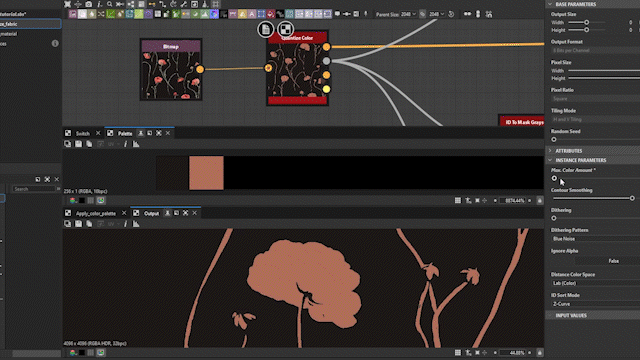
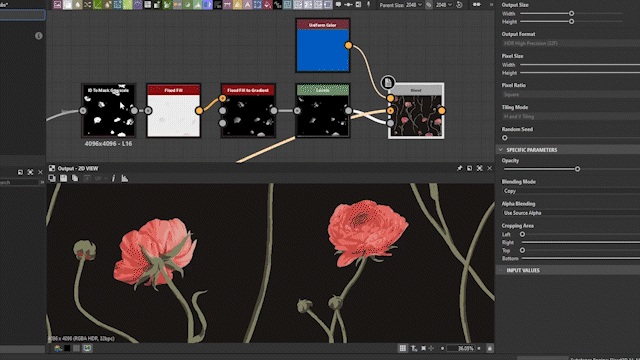

# バージョン 14.0

<b>Substance 3D Designer 14.0 </b>では、グラフの操作やパフォーマンスなど、生活の質がいくつか向上します。 しかし、何よりも新しいノード（カラーマニピュレーション、桑原フィルター、ヒストグラムツール、ベベルスムーズ、方向の距離など）が多く含まれています。 これらの変更について詳しくは、以下を参照してください。

*リリース日：2024年7月30日*

## 新規コンテンツ

この14.0バージョンでは、以下の新しいノードを備えた新しいコンテンツが多数追加されています。

* <b>色の操作に専用のノード： </b>1ノード<b>（</b>[色のクオンタイズ](../../compositing-graphs/nodes-reference-for-com/node-library/filters/adjustments/quantize-color/quantize-color.md)<b>） </b>から<b> </b>画像の色数を減らし、その中からパレット（独自のカラーパレットを作成するためのツールノードのファミリー）を抽出します（[表示](../../compositing-graphs/nodes-reference-for-com/node-library/filters/adjustments/view-color-palette/view-color-palette.md) / [作成](../../compositing-graphs/nodes-reference-for-com/node-library/filters/adjustments/create-color-palette-16/create-color-palette-16.md) / [変更](../../compositing-graphs/nodes-reference-for-com/node-library/filters/adjustments/modify-color-palette/modify-color-palette.md)<b>） </b>カラーパレット)と、ID マップ （[カラーパレットを適用](../../compositing-graphs/nodes-reference-for-com/node-library/filters/adjustments/apply-color-palette/apply-color-palette.md)）を使用して別の画像に適用するカラーパレット。 また、[グレースケールをマスクするID](../../compositing-graphs/nodes-reference-for-com/node-library/filters/adjustments/id-to-mask/id-to-mask.md)ノードを見つけ、クオンタイズカラーで計算されたID マップをグレースケールマスクに変換します。 このノードの完全なセットを使用すると、カラーを使用したスタイル設定効果を作成するために必要なものがすべて揃います。

{zoomable="yes"}

{zoomable="yes"}

* <b>桑原フィルター</b> ：さらにスタイルを適用する場合は、[桑原カラー異方性](../../compositing-graphs/nodes-reference-for-com/node-library/filters/effects/anisotropic-kuwahara/anisotropic-kuwahara.md)/[グレースケール](../../compositing-graphs/nodes-reference-for-com/node-library/filters/effects/anisotropic-kuwahara-gra/anisotropic-kuwahara-grayscale.md)フィルターを使用して絵画調の効果を生み出すことができます。 ディテールでは、画像のディテールに合わせた異方性指向性ブラーを適用します。 その結果、画像は内側のシェイプの方向に流れているように見えます。

これらのノード（クオンタイズカラーと異方性桑原）については、[このチュートリアル](https://www.adobe.com/go/designer-tutorial-quantize)で説明しています。 このガイドを使用して、マテリアルにスタイルを適用したり、カラーをより効率的かつ直感的に操作したりする方法を説明します。

その他の強力なノードがパーティに参加します。

* [<b>曲率のスムーズ</b>](../../compositing-graphs/nodes-reference-for-com/node-library/filters/effects/curvature-smooth/curvature-smooth.md) ：この新しいバージョンでは、すべてのタイリングモードが正しくサポートされ、2つの新しい出力（凸状と凹状）が追加され、精度と性能の両方が向上しました。
* <b>[Histogram equalize](../../compositing-graphs/nodes-reference-for-com/node-library/filters/adjustments/histogram-equalize/histogram-equalize.md):</b>このノードは、等分布になるように値を調整することで、グレースケールイメージのヒストグラムを等化します。 このノードには、画像のヒストグラムを出力する[ヒストグラムレンダリング](../../compositing-graphs/nodes-reference-for-com/node-library/filters/adjustments/histogram-render/histogram-render.md)と[ヒストグラム計算](../../compositing-graphs/nodes-reference-for-com/node-library/filters/adjustments/histogram-compute/histogram-compute.md)<b>という2つの関連ノードが付属しています </b>ヒストグラムをピクセルの行としてエンコードします。
* <b>[ベベルスムーズ](../../compositing-graphs/nodes-reference-for-com/node-library/filters/effects/bevel-smooth/bevel-smooth.md):</b>この機能により、マスクの境界線（外側、内側、または両方）からグラデーションまたはフラットカラーを描くことができます。 ノード[方向の距離](../../compositing-graphs/nodes-reference-for-com/node-library/filters/effects/directional-distance/directional-distance.md)<b> </b>グラデーションも描画しますが、特定の方向に描画します。
* <b>[Normal uncombine](../../compositing-graphs/nodes-reference-for-com/node-library/filters/normal-map/normal-uncombine/normal-uncombine.md):</b>このノードは、[Normal combine](../../compositing-graphs/nodes-reference-for-com/node-library/filters/normal-map/normal-combine/normal-combine.md)ノードの反対であり、Heightマップによって記述された表面の詳細を法線マップから削除します。

<table>
<tr style="border: 0;">
<td style="border: 0;" valign="top">

曲線スムーズ

<table>
  <tr>
    <td>
      
       <i>前</i>
    </td>
    <td>
      
       <i>後</i>
    </td>
  </tr>
</table>

</td>
<td style="border: 0;" valign="top">

ヒストグラムイコライザー

<table>
  <tr>
    <td>
      
       <i>前</i>
    </td>
    <td>
      
       <i>後</i>
    </td>
  </tr>
</table>

</td>
</tr>
</table>

<table>
<tr style="border: 0;">
<td style="border: 0;" valign="top">

ベベルスムーズ

<table>
  <tr>
    <td>
      
       <i>前</i>
    </td>
    <td>
      
       <i>後</i>
    </td>
  </tr>
</table>

</td>
<td style="border: 0;" valign="top">

通常の結合解除

<table>
  <tr>
    <td>
      
       <i>前</i>
    </td>
    <td>
      
       <i>後</i>
    </td>
  </tr>
</table>

</td>
</tr>
</table>

## QOLの改善

* 大きなプロジェクトで作業するときの<b>パフォーマンス</b>および<b>応答性</b>が向上しました。 たとえば、ノードの削除は最大で75倍高速です。 同じビットマップを数回参照するグラフの場合、[クッキング](../../glossary/glossary.md)時間も短縮されました。
* <b>継承されたパラメーター</b>:パラメーターが[継承](../../glossary/glossary.md)の場合、既定値を表示する代わりに、継承されたパラメーターを表示して、現在使用されている値を確認できるようにします。 継承について詳しくは、[アドビのドキュメントのこの専用ページ](../../compositing-graphs/inheritance-compositing/inheritance-in-substance-compositing-graphs.md)をご覧ください。
* macOSでの<b>トラックパッドのサポート</b>は、他のソフトウェアに合わせて、より自然になるように完全に修正されました。 [グラフビュー](../../interface/the-graph-view/the-graph-view.md)の境界を超えるノードの移動も、すべてのオペレーティングシステムでスムーズで一貫性を保つために再検討されました。

* <b>2Dビュー： </b>[2Dビュー](../../interface/2d-view/2d-view.md)でタイル表示が有効になっている場合、元のタイルにないピクセルについても値を取得できるようになりました。タイル間で[サンプリング](../../glossary/glossary.md)および値のトランジションを確認する場合に非常に役立ちます。

{width="320px" zoomable="yes"}

* <b>グラデーションマップ</b>:マウスの中クリックを使用して、すべての[グラデーションキー](../../compositing-graphs/nodes-reference-for-com/atomic-nodes/gradient-map/gradient-map.md)を左または右に移動します（すべてのキー間のすべてのギャップを保持します）。
* <b>パラメーター</b>:パラメーターを使用してカスタム関数を挿入するために、関数の編集ウィジェットを使用できるようになりました。 これは、[Substance関数グラフ](../../function-graphs/the-function-graph/the-function-graph.md)を使用してパラメーターを操作するカスタムツールを作成するための強力なソリューションです。

<table>
<tr style="border: 0;">
<td style="border: 0;" valign="top">

{zoomable="yes"}

</td>
<td style="border: 0;" valign="top">

{zoomable="yes"}の編集

</td>
</tr>
</table>

## APIの改善

スクリプトAPIには、次の4つの新しいメソッドが含まれています。

* Substance合成グラフのグラフ型を取得・設定するメソッド： myGraph.setGraphType(&quot;newType&quot;) ; myGraph.getGraphType()
* エディタでパッケージリソースを開くメソッド（例：グラフビューのSubstanceグラフ）: myUIManager.openResourceInEditor(myResource)
* エクスプローラーでパッケージリソースを選択するメソッド（例：Substanceグラフ）: myUIManager.setExplorerSelection(myResource)
* グラフビューで特定のノードをフレーム化するメソッド： myUIManager.focusGraphNode(myGraphViewID, myNode)

## VFXプラットフォームの要件

[VFXリファレンスプラットフォーム](https://vfxplatform.com/)では、ソフトウェア間の互換性の問題を最小限に抑えるため、VFX業界のすべてのソフトウェアで使用されるツールとライブラリのバージョンの一覧を毎年公開しています。 通常どおり、これらのすべての推奨事項に従って&#x200B;*すべての依存関係を更新*&#x200B;します。

これらのアップデートには、次の2つの大きな影響があります。

* <b>Linuxの要件</b>が変更され、DesignerではRHELバージョン8または9が必要になりました（CentOSはサポートされなくなりました）。 詳細については、[必要システム構成](../../getting-started/system-requirements/system-requirements.md)ページをご覧ください。
* Qt6で一部の関数が廃止されたため、<b>Designerのプラグインを</b>更新する必要があります。 プラグインを更新するために必要なすべての情報は、[コミュニティフォーラム](https://community.adobe.com/t5/substance-3d-designer-discussions/plugins-required-updates-in-designer-14-0/td-p/14768559)にあります。

## リリースノート

### 14.0.0

*（2024年7月30日リリース）*

### 追加日

* [コンテンツ]新しい異方性桑原フィルタ
* [コンテンツ]新規ベベルスムーズノード
* [コンテンツ]新規曲線スムーズv2ノード
* [コンテンツ]新規方向の距離ノード
* [コンテンツ]新しいヒストグラムツール：計算、イコライズ、レンダリング
* [コンテンツ]マスクノードへの新しいID
* [コンテンツ]新しい[法線の結合解除]ノード
* [コンテンツ]新しいパレットノード：作成、適用、修正、表示
* [コンテンツ]新規クオンタイズカラーノード
* [コンテンツ]不均一な方向ワープ： [強度マップ]の既定値を1に設定します。
* [コンテンツ]これらのバージョンのすべてのノードラベルに&#39;Color&#39;または&#39;Grayscale&#39;サフィックスを追加します
* [コンテンツ] 「ホワイトノイズ」を廃止「ホワイトノイズを高速にする」のみを維持する
* [コンテンツ] Substance関数グラフで「Negate Float1」ノードを廃止する
* [コンテンツ] 「カラーを量子化」の名前を「カラーを量子化（シンプル）」に変更
* [2Dビュー] 0 ～ 1の範囲外のピクセルの値が情報パネルに表示される
* [Engine][Text]一部のフォントの新しいカーニング
* [グラフ]インコンテキスト編集中にディープサブグラフを編集する際の無効化時間を短縮
* [リンカー] SBSASMでビットマップを複製しない
* [パラメーター]すべての入力パラメータータイプに新しい「関数」ウィジェットを追加します
* [プロパティ]継承されたパラメータの表示を改善します
* [UX]トラックパッドのサポートの強化（Macのみ）
* [UX]選択時にグラフの境界線に達した場合のパンの最新化
* [UX] 「高DPIを無効にする」機能の削除
* [ブランディング]スプラッシュ画面と「バージョン情報」ウィンドウの新しいブランディング
* [グラデーションマップ]すべてのキーとループをシフトする方法を追加する
* [ライブラリ]すべてのデフォルトフィルターを文頭のみ大文字に切り替え
* [API]グラフビュービューポートで特定のノードをフレームするメソッドを追加する
* [API]パッケージリソースをエディタ（グラフビューのSubstanceグラフなど）で開くメソッドを追加する
* [API] Addメソッドを使用して、エクスプローラーでパッケージリソース（Substanceグラフなど）を選択します。
* [API] Substance合成グラフのグラフ型を取得・設定するメソッドを追加する
* [サードパーティ] 2023年のVFXプラットフォームの推奨事項に従う
* [サードパーティ] 2024年のVFXプラットフォームの推奨事項に従う
* [サードパーティ] 23.08に1.82.0米ドルを追加したアップデート
* [サードパーティ] NGLを1.38にアップデート
* [サードパーティ] OpenColorIOを2.3.xに更新
* [サードパーティ] OpenExrを3.2.xにアップデートする
* [サードパーティ] OpenSubdivを3.6.xに更新する
* [サードパーティ] Pythonを3.11.xにアップデートする
* [サードパーティ] Qtを6.5.xに更新
* [サードパーティ] gccを11.2.1にアップデートします。
* [サードパーティ] glibcを2.28にアップデートする
* [サードパーティ] libstdc++ ABIをC++11 oneに更新
* [Documentation]新しい「用語集」ページ

### 修正

* [ベイカー]ファイル名が変更されたシーンを再ベイク処理するとクラッシュする
* [ベイカー]ベイカープリセットをJSONファイルに保存するとクラッシュする
* [コンテンツ] &#39;スプライン上の散乱&#39;：入力画像のアルファパラメーターを公開します
* [コンテンツ] &#39;タイルSamplerの色&#39;: visibleif式がありません
* [コンテンツ]異方性反射ノイズ： [X/Y量]の負の値が間違った結果を生成する
* [コンテンツ]異方性雑音：奇数の値をX量として使用し、Smoothnessを使用しない場合のタイリングの問題
* [コンテンツ]通常の分布関数：max()の配置が正しくないと、NaNが発生する可能性があります
* [コンテンツ]一部のプラットフォームで、RTO、曲がった法線、RTシャドウが正しく動作しない
* [コンテンツ]シェイプスプラッタのブレンドカラー： OpenGL法線マップが正しくブレンドされない
* [コンテンツ]ノードラベル内の&#39;Multi&#39;プレフィックスの後に不適切なスペースがあります
* [依存関係]パッケージ内またはパッケージ間でグラフを移動するとクラッシュする
* [エンジン]ワープノードの精度エラーが勾配ぼかしノードに影響する
* [エンジン] 2 GBを超えるSBSASMコンテンツがある場合、SDのSBSARレイヤーでSBSARを読み取れない
* [関数グラフ] 0^nの結果が正しくありません
* [グラフ] &#39;表示ノードサイズ&#39;オプションのラベルが正しくない
* [グラフ]親のあるコメントを別のグラフにコピーするとクラッシュする
* [グラフ] Altキーを押しながらドットノードをドラッグするとフリーズする
* [グラフ]ノード検索で明白な一致が見落とされる場合がある
* [グラフ]スーパーグラフを開いた状態で関数グラフを複数回編集すると、パフォーマンスの問題が発生する
* [グラフ]出力の作成時に無効な値が多すぎます
* [セキュリティ] ICO解析の領域外メモリーへの書き込みの脆弱性
* [セキュリティ]未使用の画像形式を廃止する
* [パラメータ]ビットマップPKGリソースパスは編集できません
* [パラメーター]値プロセッサーのパラメーターの公開/バッチ公開に関連する問題を修正します
* [パラメーター]バッチ公開では文字列パラメーターは無視されます
* [プロパティ]プロパティを開いた状態で関数グラフを複数回編集すると、パフォーマンスの問題が発生する
* [SVG]ラスタライズした画像でシェイプの編集が適用されない
* [UI]スクロール可能なウィジェットに関するいくつかのバグ/矛盾を修正しました（Windowsのみ）
* [UI]読み込み/書き出しリストの3Dシーンファイル形式の順序が一致しない
* [UI]ウィンドウのアクションがUIに複製される
* [バージョン管理] &#39;perforce.py&#39;スクリプトがPython 3で動作しません
