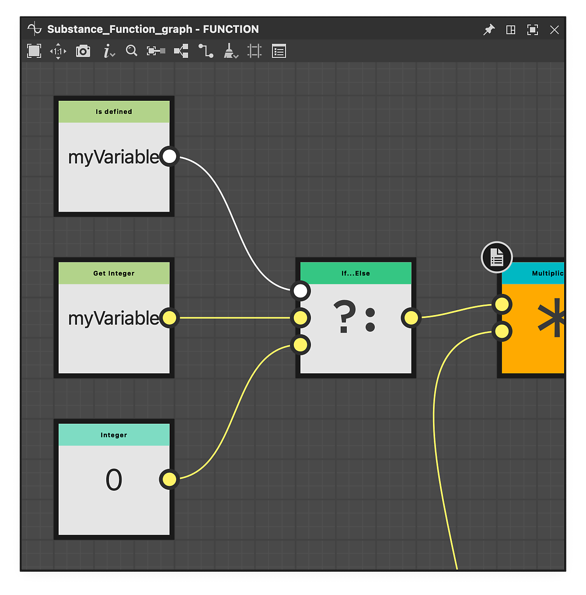

# バージョン15.1

Substance Designer 15.1では、グラフ作成ウィンドウが全面的に改善され、サンプルを直接表示できるようになりました。また、ノイズノードが改善されているためクリエイティブな作業が増え、ノードメニューのカテゴリが整理されています。

*リリース日：2025年12月11日*

## グラフ作成の改善

このリリースでは、[グラフ作成ウィンドウ](../../compositing-graphs/creating-compositing-gra/creating-a-substance-compositing-graph.md)が<b>全面的に再設計</b>され、Substance 3D Designerでの最初のユーザーエクスペリエンスが向上しました。 このアップデートの主な目標は、テンプレート選択プロセスを合理化して、ユーザーが要件に最も適したテンプレートを効率的に特定できるようにすることです。

サムネールには、目的のマテリアルタイプの<b>視覚的な参照</b>が即座に表示され、詳細なツールチップにはすべての関連情報が表示されます。 整理しやすくするために、テンプレートは、マテリアル、フィルター、スキャン処理などの特定の<b>カテゴリ</b>に分類されるようになりました。

メインインターフェイスはアップグレードされましたが、リスト、パッケージ、ディレクトリのオプションなど、以前のビューに引き続きアクセスできます。

[詳細情報](../../compositing-graphs/creating-compositing-gra/creating-a-substance-compositing-graph.md)

{zoomable="yes"}

## 埋め込みサンプル

再設計されたグラフ作成ウィンドウの起動に伴い、様々な[<b>サンプル資料</b>](../../compositing-graphs/creating-compositing-gra/material-samples/material-samples.md)をソフトウェア内に直接追加しました。 この機能強化は、学習リソースへのアクセスを改善したいというお客様の要望に応えるものです。

{zoomable="yes"}

このニーズを満たすために、我々は生地（革やサテンを含む）、木材、金属、プラスチック、セラミックなどの材料サンプルを含んでいます。 これらの例は、プロジェクトを簡単に開始し、Substance 3D Designerで使用可能なメインファミリーノードについて理解するのに役立ちます

各グラフには<b>注釈</b>が付いており、慎重に整理されています。また、できるだけ理解しやすくするために、最小限のノード数が含まれています。

新しいSubstanceグラフを作成する際に「Material samples」カテゴリのサンプルにアクセスすることも、ホーム画面から便利な「Go to samples」ボタンを使用して直接アクセスすることもできます。

これらの基本マテリアルに加えて、<b>FX-mapとピクセルプロセッサー</b>の機能をより効果的に使用する方法を示す<b>高度なサンプル</b>も提供しました。

[詳細情報](../../compositing-graphs/creating-compositing-gra/material-samples/material-samples.md)

{zoomable="yes"}

## 新しいノイズ

ノイズは、ほとんどのグラフで重要な役割を果たします。そのため、このリリースでは、その機能と使いやすさを向上させるために、いくつかの重要な機能強化に焦点を当てています。

このアップデートでは、ノイズパターンが強制的にタイル表示されることなく予期したとおりに動作するように、<b>非タイル表示シナリオのサポート</b>が改善されました。 以前は、ノイズノードが強制的にタイル表示されるか、タイル表示が無効になっている場合に誤った結果が生成されていました。

現在、ほとんどのノイズには<b>新しいパラメーター</b>が含まれており、ユーザーがよりクリエイティブにコントロールできるようになっています。 これらの追加オプションにより、グラフ作成者はワークフロー内のノイズの外観と動作を微調整できます。

最後に、ビット深度が<b>16ビットにハードロックされなくなりました</b>。 個々のノードインスタンスでビット深度の設定を上書きできるようになりました。これにより、必要に応じて詳細およびダイナミックレンジを拡大したり、パフォーマンスを上げるためにグラフを最適化したりできます。

以下の[リリースノート](#release-notes)で、更新されたノイズの完全なリストを参照してください。

例： [セル 1](../../compositing-graphs/nodes-reference-for-com/node-library/texture-generators/noises/cells-1/cells-1.md) [雲2](../../compositing-graphs/nodes-reference-for-com/node-library/texture-generators/noises/clouds-2/clouds-2.md) [方向の傷](../../compositing-graphs/nodes-reference-for-com/node-library/texture-generators/noises/directional-scratches/directional-scratches.md) [湿気ノイズ1](../../compositing-graphs/nodes-reference-for-com/node-library/texture-generators/noises/moisture-noise/moisture-noise.md)

{zoomable="yes"}

## ノードメニューの階層

広範なライブラリ内に特定のノードを配置するという課題に対処するために、ノードメニューにカテゴリを導入しました。

使用可能なノードの数が非常に多いため、目的のノードをすばやく見つけるのが困難な場合があります。 このプロセスを合理化するために、新しい[<b>グループ</b>属性](../../compositing-graphs/graph-parameters/graph-parameters.md)がグラフレベルで実装されました。 この属性を定義すると、検索結果の整理や並べ替えに使用されます。

<table>
<tr style="border: 0;">
<td style="border: 0;" valign="top">

{zoomable="yes"}

</td>
<td style="border: 0;" valign="top">

{zoomable="yes"}

</td>
</tr>
</table>

## デフォルト出力

ノードに複数の[出力](../../compositing-graphs/nodes-reference-for-com/atomic-nodes/output/output.md)がある場合、2Dビューまたはノードサムネイルですべての出力を同時に表示することはできません。 このようなシナリオの一般的なガイドラインは、最初に接続されたピンを使用するか、接続されていない場合はデフォルトで最初の出力を使用することです。

ただし、この方法では常に最適な結果が得られるとは限りません。 たとえば、一部のスプラインノードでは、最初に接続したピンがスプライン座標データを表すことが多く、プレビューには適していません。

この問題に対処するために、デフォルトの出力属性が導入されました。 この機能を使用すると、グラフ作成者は<b>既定で表示する出力を指定</b>できます。これにより、ノードの使用感が向上し、作成されたグラフをより明確に理解できるようになります。

以下の画像を再生して、デフォルトの出力定義の前後の違いを確認してください。

[詳細情報](../../compositing-graphs/nodes-reference-for-com/atomic-nodes/output/output.md)

<table>
  <tr>
    <td>
      
       <i>前</i>
    </td>
    <td>
      
       <i>後</i>
    </td>
  </tr>
</table>

## &#39;Is defined&#39;ノード

関数グラフを操作する場合、[変数](../../function-graphs/nodes-reference-for-fun/atomic-function-nodes/get-nodes/get-nodes.md)がグラフ内に存在するかどうかを判断する必要が生じることがあります。

例えば、変数が存在しないことを検出すると、フォールバック値を指定できるので、すべての入力を明示的に設定しなくても関数が期待どおりに動作します。 [&#39;Is defined&#39;ノード](../../function-graphs/nodes-reference-for-fun/atomic-function-nodes/get-nodes/get-nodes.md)を追加しました。

[詳細情報](../../function-graphs/nodes-reference-for-fun/atomic-function-nodes/get-nodes/get-nodes.md)

{zoomable="yes"}

## リリースノート

### 15.1.0

*（2025年12月11日リリース）*

### 追加日

* [NewGraph]新規グラフウィンドウのリワーク
* [NewGraph]マテリアルサンプルと高度なサンプルを追加する
* [新規グラフ]テンプレートデータのグラフに新しい属性（カテゴリとサブタイトル）を追加します
* [NewGraph]出力形式オプションの削除
* [コンテンツ]ハッシュ関数を追加する
* [コンテンツ] functions.sbsにトネマッパーを追加する
* [コンテンツ]異方性反射ノイズv2：既定の出力形式を追加、無秩序を追加
* [コンテンツ]ノードラベルとパラメータラベルに文頭のみ大文字を適用する
* [コンテンツ] BnWスポット1 v2:デフォルトの出力形式を追加、タイリングをサポートしない
* [コンテンツ] BnWスポット2 v2:デフォルトの出力形式を追加、タイリングをサポートしない
* [コンテンツ] BnWスポット3 v2:デフォルトの出力形式を追加、タイリングをサポートしない
* [コンテンツ] セル 1、2、3、4 v2：デフォルトの出力フォーマットの追加、タイル分割のサポートなし、disorder options
* [コンテンツ] Clouds 1 v2:デフォルトの出力形式を追加します。タイリングはサポートされません。
* [コンテンツ] Clouds 2 v2:デフォルトの出力形式を追加します。タイリングはサポートされません。
* [コンテンツ] Clouds 3 v2:デフォルトの出力形式を追加します。タイリングはサポートされません。
* [コンテンツ] v2をマスクするカラー
* [コンテンツ] 方向性ノイズ 1 v2:デフォルトの出力フォーマットを追加します。タイル表示はサポートされません。
* [コンテンツ] 方向性ノイズ 2 v2:デフォルトの出力フォーマットを追加します。タイル表示はサポートされません。
* [コンテンツ] 方向性ノイズ 3 v2:デフォルトの出力フォーマットを追加します。タイル表示はサポートされません。
* [コンテンツ] 方向性ノイズ 4 v2:デフォルトの出力フォーマットを追加します。タイル表示はサポートされません。
* [コンテンツ] Directional scratches v2:デフォルトの出力形式を追加します。タイリングはサポートされていません。
* [コンテンツ] Dirt 1 v2:デフォルトの出力フォーマットを追加します。タイル表示はサポートされません。
* [コンテンツ] Dirt 2 v2:デフォルトの出力フォーマットを追加します。タイル表示はサポートされません。
* [コンテンツ] Dirt 3 v2:デフォルトの出力フォーマットを追加します。タイル表示はサポートされません。
* [コンテンツ] Dirt 4 v2:デフォルトの出力フォーマットを追加します。タイル表示はサポートされません。
* [コンテンツ] Dirt 5 v2:デフォルトの出力フォーマットを追加します。タイリングはサポートされません。
* [コンテンツ]Dirt勾配v2：既定の出力フォーマットを追加、新しい無秩序オプション
* [コンテンツ] フラクタル和ベースv2：デフォルトの出力フォーマットの追加、乱れ、タイル表示のサポートなし
* [コンテンツ] フラクタル和 1,2,3,4 v2：既定の出力フォーマットを追加
* [コンテンツ]ガウスノイズv2：デフォルトの出力形式を追加します。タイリングはサポートされません。
* [コンテンツ]ガウスの斑点1&amp;2 v2 :デフォルトの出力形式を追加、タイリングをサポートしない
* [コンテンツ]乱雑な繊維1,2,3 v2:デフォルトの出力形式を追加、タイル分割サポートなし、混乱オプション
* [コンテンツ]湿気ノイズv2：既定の出力フォーマットを追加し、タイリングをサポートしない
* [コンテンツ]新しい「湿気ノイズ2」ノード
* [コンテンツ]ノイズ：アップデートしてデフォルトの出力形式を追加
* [コンテンツ] Perlinノイズv2：デフォルトの出力形式を追加します。タイリングはサポートされません。
* [コンテンツ]シェイプマッパー：フィルタモードを追加
* [コンテンツ] UVマッパー：フィルタモードを追加
* [コンテンツ]波形1 v2：デフォルトの出力形式と新しいオプションを使用
* [コンテンツ]ホワイトノイズv2：デフォルトの出力形式を使用、配布オプションを追加
* [ベイカー]選択したメッシュからのみUVを表示します
* [ベイカー]ジオメトリを名前で照合する方法を選択するオプションを追加します
* [ベーカーの場合]ベーカーを削除する際に最も近いベーカーを選択します
* [ベイカー] UDIM:ベイクするUVタイルのリストを定義します。
* [ベイカー]ベイクSDKを3.15.4にアップデート
* [3Dビュー/SceneBrowser] UsdPrimitiveを右クリックしても選択しない
* [ColorManagement] ACES 2.0のサポート
* [合成グラフ]出力ノードを「デフォルト出力」として設定できます
* [Cooker]機能インスタンスの未接続の入力に対する警告を取り除きます†
* [関数] isDefined演算子を追加します
* [グラフ]ノードメニューの「グループ」属性ごとに項目をグループ化します
* [グラフ]サムネールレンダリングを改善する

### 修正

* [3D表示] L16グレースケールテクスチャが環境またはbaseColorに接続されると赤い色合いで表示される
* [3Dビュー]マテリアルのないシーンのマテリアルバインドを変更すると、新しい「デフォルト」のマテリアルが作成される
* [3Dビュー]特定のOBJメッシュに対して計算された法線が正しくない
* [3Dビュー] SBSCNからのカスタム環境がパストレーサでの読み込み時に表示されない
* [3Dビュー]無効になっている環境を回転すると、コンソールにエラーが表示される
* [3Dビュー]Specular levelが正しく適用されない
* [3Dビュー] Eclairラスタライザーを使用すると、Specular edge colorが機能しない
* [3Dビュー]ユーザが追加したマテリアルが既定のシーンに適用されない
* [3D表示]&#x200B;[ベーカーさん]オーバーライドしたマテリアルカラーや「カラー」ベーカーを使用した場合に、マテリアルカラーが暗すぎる
* [3Dビュー]&#x200B;[ベイカー] FBXファイルのマテリアルカラーが表示されない
* [ベイカー] FBXファイルのマテリアルカラーが正しく検出されない
* [ベイカー] JSONプリセットの書き出しで、「recompute\_tangents」オプションが常に「false」になる
* [ベイカー] CLI:JSONファイルを使用して同じベイカーを連続して実行するとクラッシュする
* [ベーカー] &#39;グレースケール&#39;で&#39;color-generator&#39;パラメーターを更新できません
* [コンテンツ]パスへのマスク：非正方形の比率で失敗する
* [コンテンツ] PBR レンダリング/アイコンレンダラー：Specularローブ機能が正しくありません
* [コンテンツ]スプラインへのパス： [出力サイズ]を既定で[親に対して相対的]に設定します
* [コンテンツ]ポイントリスト：データテクスチャが正方形でない場合、ポイントの順序が正しくありません
* [コンテンツ]スプラインマッパー：ランダムな場合の1pxの線のグリッチ
* [コンテンツ]スプラインマッパー：Thicknessが0の場合にストレッチされたUVが表示される
* [グラフ]関数サブグラフの出力を削除するとクラッシュする
* [グラフ]入力ノードの色タイプは読み取り専用パッケージで変更可能
* [グラフ]プライマリ入力は読み取り専用パッケージで変更可能
* [プロパティ]カラープレビューウィジェットの色がsRGBボタンの状態と一致しません
* [シーン] 2 GBを超えるOBJファイルをロードできない
* [UI]再起動後、コンソールと依存関係マネージャーのドッキング状態が復元されない

### 既知の問題

* [ベイカー]特定のNVIDIAドライバーを使用してベイク処理を行うとクラッシュする
* [3Dビュー] OpenGL：読み込んだ一部のシーンがレンダリングされない場合がある
* [3D View] Pathtracer：テッセレーション/ディスプレイスメントを有効にしてテクスチャを更新すると、パフォーマンスが遅くなる
* [3Dビュー]上書きすると、一部のカラーマテリアルプロパティが正しくカラーマネジメントされない
* [3Dビュー]アニメートされたプリミティブを含むシーンが正しくサポートされていない
* [3Dビュー]複数のUDimsを持つメッシュはまだサポートされていません
* [3Dビュー]複数のUVを持つメッシュはサポートされておらず、無効なマテリアルレンダリングが生じる可能性があります
* [3Dビュー]パストレーサーはAMDグラフィックカードではサポートされていません
