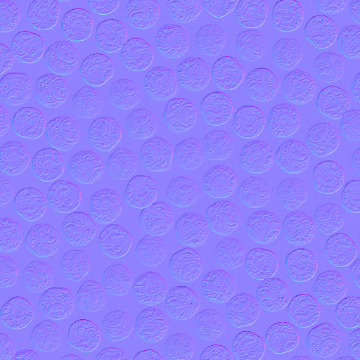
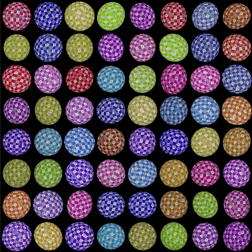
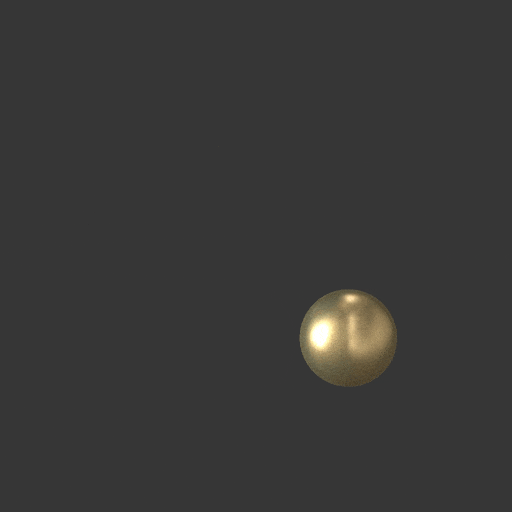

# バージョン16.0

このバージョン16.0では、新しいシェイプスプラッタとSDFノードにより、パターンのスキャタリングと操作に関してよりクリエイティブなワークフローが導入されています。 また、OpenPBRをネイティブにサポートし、3Dビューのディスプレイスメント設定を改善します。

*リリース日：2026年4月14日*

## シェイプスプラッタv2ノード

### シェイプを散布する新しい方法

新しい[シェイプスプラッタv2](../../compositing-graphs/nodes-reference-for-com/node-library/texture-generators/patterns/shape-splatter-v2/shape-splatter-v2.md)のノードでは、これまで困難であった複雑な散乱動作がロック解除され、既定では&#x200B;*無衝突*&#x200B;の&#x200B;**より多くのシェイプ分布方式** （ポアソン円盤、均一）が使用され、**密度マップ**&#x200B;で特定の領域のシェイプの&#x200B;*クリーンギャザリング*&#x200B;を制御できます。\
上級ユーザーは、関数グラフで定義された&#x200B;*カスタムディストリビューション*&#x200B;を設定できます。

<table style="margin-top: 32px; margin-bottom: 32px">
    <tr style="border: 0">
        <td style="width: 33%; border: 0">
             <i>ポアソン分布</i>
        </td>
        <td style="width: 33%; border: 0">
             <i>均一な分布</i>
        </td>
        <td style="width: 33%; border: 0">
             <i>シェイプスプラッタv2: 密度マップ</i>
        </td>
    </tr>
</table>

### 3Dシェイプ

散在するシェイプは&#x200B;**3Dオブジェクト**&#x200B;になり、すべてのXYZ軸で移動、回転、拡大・縮小できます。

立方体、球、円柱などの&#x200B;**単純なプリミティブ**&#x200B;を使用するか、*Heightマップの押し出し*&#x200B;または&#x200B;*3D SDFシェイプ*&#x200B;のオーサリングで形成された&#x200B;**複雑なカスタムシェイプ**&#x200B;を使用します。 （詳細は以下を参照）

これにより、よりダイナミックで変化に富み、全体的に信頼できるスキャッターが実現します。 さらに、3Dシェイプを反転して、バリエーション用に再利用できるようになりました。 （環境アーティストの皆さん）

<table style="margin-top: 32px; margin-bottom: 32px; border: none">
    <tr style="border: 0">
        <td style="width: 33%; border: 0">
             <i>ランダムな3D回転</i>
        </td>
        <td style="width: 33%; border: 0">
             <i>図形の浮き出し</i>
        </td>
        <td style="width: 33%; border: 0">
             <i>3D SDFシェイプ</i>
        </td>
    </tr>
</table>

### 関連リンパ節

Shape splatter v1ファミリのノードと同様に、Shape splatter v2にはコンパニオンノードの独自のコホートが付属しています。

[シェイプスプラッタv2マッパー](../../compositing-graphs/nodes-reference-for-com/node-library/texture-generators/patterns/shape-splatter-v2-mapper-color/shape-splatter-v2-mapper-color.md)のノードでは、複数のテクスチャをマッピングするための&#x200B;*3平面投影*&#x200B;および&#x200B;*マテリアルID*&#x200B;をサポートすることで、散乱した3Dシェイプにテクスチャを投影できます。 結果は、テクスチャのオフセットとカラーバリエーションについて、グローバルにまたはシェイプごとに調整できます。\
上級ユーザーは、関数グラフで定義された&#x200B;*カスタムテクスチャマッピング*&#x200B;をセットアップできます。

[シェイプスプラッターv2 to mask](../../compositing-graphs/nodes-reference-for-com/node-library/texture-generators/patterns/shape-splatter-v2-to-mask/shape-splatter-v2-to-mask.md)は、特定のシェイプやマテリアルIDの選択用のマスクを作成し、グラフの下流でシェイプをより細かく使用できるようにします。

<table style="margin-top: 32px; margin-bottom: 32px; border: none">
    <tr style="border: 0">
        <td style="width: 33%; border: 0">
             <i>三平面マッピング</i>
        </td>
        <td style="width: 33%; border: 0">
             <i>通常のマッピング</i>
        </td>
        <td style="width: 33%; border: 0">
             <i>SDFシェイプからマテリアルIDごとにマッピング</i>
        </td>
    </tr>
</table>

### グリッドアトラス

<table>
    <tr style="vertical-align: top; border: 0">
        <td style="border: 0">
            
カスタムパターンは、シェイプスプラッタv2ノードに個別に提供することも、グリッドアトラスにパックして、より緩やかで効率的なワークフローを実現することもできます。

新しい<a href="../../compositing-graphs/nodes-reference-for-com/node-library/texture-generators/patterns/grid-atlas-color/grid-atlas-color.md">グリッドアトラス</a>ノードにより、パッキングパターンが簡素化されました。

        </td>
        <td style="text-align: right; width: 33%; margin-left: 32px; border: 0">
            
        </td>
    </tr>
</table>

### 材料サンプル

<table style="border: none">
    <tr style="border: none">
        <td style="border: none; vertical-align: top">
            
<b>錆びたボルト</b> <a href="../../compositing-graphs/creating-compositing-gra/material-samples/material-samples.md">材料サンプル</a>は、ノードの形状スプラッタv2ファミリーとその特徴をジャンプするために使用できます。

グラフの構造、ノード設定、およびテクニックをガイドするために、グラフが整理され、注釈が付けられています。

また、<i>完全に編集可能</i>であるため、サンドボックスとして使用して、シェイプスプラッタv2ツールセットをより実践的に理解することができます。 好きなだけサンプルグラフを作って頂けるので、自由に試してみてください。

        </td>
        <td style="border: none; width: 20%; vertical-align: top; text-align: right">
            
        </td>
    </tr>
</table>

## 3D SDFノード（符号付き距離フィールド）

<table>
    <tr style="vertical-align: top; width: 75%; border: 0">
        <td style="border: 0">
            
Designer 16.0では、オーサリングSDF 関数用の膨大なノードのカタログを使用して、関数グラフに3Dシェイプを生成する強力な機能が追加されています。

符号付き距離フィールドは、数学的に定義されたサーフェスまでの距離として空間を表現したものです。 これらのサーフェスは、さまざまな演算子を使用して変換および結合されるため、複雑さが増すシェイプを定義するために使用できます。

        </td>
        <td style="text-align: right; width: 25%; margin-left: 32px; border: 0">
            
        </td>
    </tr>
</table>

### 3D SDF 関数の作成

SDF 関数には、次の4つのカテゴリに分類される[新しいノードファミリ](../../function-graphs/nodes-reference-for-fun/function-node-library/function-node-library.md#sdf-functions)が含まれます：

* **プリミティブ**&#x200B;は基本的な構成要素です。必要に応じて調整できるいくつかのコントロールを備えたシンプルで調整可能なシェイプを生成します。
* **演算子**&#x200B;を使用すると、ノードに応じて、単純なブール演算子からモーフ、シェル、対称性まで、単純な方法または複雑な方法でシェイプを組み合わせたり複製したりすることができます。これらの演算子を使用すると、どのような3Dシェイプを実現できるかについての可能性が大幅に広がります
* **変形**&#x200B;を使用すると、シェイプの位置、回転、サイズを思いどおりに調整し、さらに曲げ、ひねり、伸びを加えることができます。
* **マテリアル**&#x200B;ノードでは、色やマテリアルIDなどのいくつかの基本的なマテリアル属性を設定できます。これらは、シェイプをマスクまたはカラー設定するために[シェイプスプラッタv2](../../compositing-graphs/nodes-reference-for-com/node-library/texture-generators/patterns/shape-splatter-v2/shape-splatter-v2.md)ノードファミリで使用できます。

>[!INFO]
> 
> [ノードの操作](../../function-graphs/nodes-reference-for-fun/function-node-library/function-nodes-sdf-functions/working-with-sdf-functions.md)ページに移動して、これらのSDF 関数の操作を開始してください。

明確で読みやすいアイコンが付いた軽量のノードにより、3D SDF 関数の構築が思ったより簡単になります。特に、ツールセットに次に追加された機能により…

### 3Dビューアノード

3D SDF 関数を作成する際には、作成されたシェイプを3D空間で視覚化する必要があります。 [3Dビューアノード](../../compositing-graphs/nodes-reference-for-com/node-library/filters/effects/3d-viewer/3d-viewer.md)は、3D SDFまたは交差機能を、調整可能なカメラコントロール、カスタム環境ライト、および基本マテリアルのレンダリングのサポートを備えた3Dシーンとしてレンダリングします。 （カラー、粗さ、メタライズ）

このノードには、生成されたシェイプを詳細にチェックする機能や、デバッグの問題に関する機能(個別のレンダリングパス(AOV)、SDFアイソライン、およびビジュアルヘルパー)も含まれています。 (E.g. 裁ち落とし色、グリッド、回転の円弧)

<table style="margin-top: 32px; margin-bottom: 32px">
    <tr style="width: 50%; border: 0">
        <td style="text-align: center; width: 50%; border: 0; padding: 15px">
            
        </td>
        <td style="width: 50%; border: 0; padding: 0">
            <table>
                <tr style="vertical-align: top; border: 0">
                    <td style="text-align: center; border: 0">
                        
                    </td>
                    <td style="text-align: center; border: 0">
                        
                    </td>
                </tr>
                <tr style="vertical-align: top; border: 0; background: transparent">
                    <td style="text-align: center; border: 0; background: transparent">
                        
                    </td>
                    <td style="text-align: center; border: 0; background: transparent">
                        
                    </td>
                </tr>
            </table>
    </tr>
</table>

## OpenPBR のサポート

[OpenPBR面](https://academysoftwarefoundation.github.io/OpenPBR/)は、コンピューターグラフィックスの標準として意図された面シェーディングモデルの仕様であり、大部分のマテリアルを正確にモデリングできます。

このマテリアルモデルは、アプリケーション全体でサポートされるようになりました。新しいレンダラー（ラスタライザー、GPU パストレーサー）とOpenGLレンダラーの両方に[専用のシェーダ](../../interface/3d-view/material-properties/material-properties.md#openpbr)があります。

新しいグラフテンプレートを使用して、広く採用されているこの業界標準の作業を開始しましょう。または、OpenPBRに基づいて組み込まれているマテリアルサンプルを確認しましょう。

<table style="border: none; margin-top: 32px; margin-bottom: 32px">
    <tr style="vertical-align: top; border: 0">
        <td style="text-align: center; border: 0">
            
        </td>
        <td style="text-align: center; border: 0">
            
        </td>
    </tr>
</table>

OpenPBRシェーダが3Dビューのデフォルトになり、従来のPBRの使用をOpenPBRに一致させることで、以前のバージョンのグラフをネイティブにサポートするようになりました。

OpenPBRシェーダは、薄膜や薄壁などの既存のシェーダよりも多くのエフェクトをサポートしています。 ラスタライズ（ラスタライザー、OpenGL）ではすべてのエフェクトを使用でき、長い時間での屈折も可能です。

<table style="border: none;">
    <tr style="vertical-align: top; border: 0">
        <td style="border: 0">
            また、3Dビューで表示されるグラフがそのグラフのマテリアルモデルに適切なシェーダを使用するように、Substanceグラフに新しい<a href="../../compositing-graphs/graph-parameters/graph-parameters.md#attributes">'マテリアルモデル'アトリビュート</a>を使用することで、特定のシェーダに関連するワークフローを同期させる方が簡単です。
        </td>
        <td style="text-align: right; margin-left: 32px; border: 0">
            
        </td>
    </tr>
</table>

>[!NOTE]
> 
>この属性は、公開されたSBSARファイルにも含まれており、マテリアルワークフローに統合されます。

## 3Dビューのディスプレイスメントコントロール

3Dビューツールバーの[新しいディスプレイスメントポップアップ](../../interface/3d-view/displacement/displacement.md)から直接アクセスできるため、3Dビューでのディスプレイスメントとテッセレーションをより迅速かつ簡単に調整できるようになりました。

マテリアルプロパティとレンダラーの設定を何度も繰り返さずに、**Heightスケール**、**Heightレベル**&#x200B;および&#x200B;**テッセレーション**&#x200B;の値を調整します。

これらのコントロールは、新しいレンダラー（ラスタライザー、GPU パストレーサー）とOpenGLレンダラーの両方で使用できます。

シーンに複数のマテリアルが含まれている場合は、<code>Shiftキーを押しながら、事前に調整するシーンのオブジェクトを選択します</code> をクリックするか（ラスタライザとGPU パストレーサーのみ）、Scene Browserで選択します。

>[!NOTE]
> 
>テッセレーションは、ラスタライズとGPU パストレーサーではオブジェクト単位&#x200B;*で*、OpenGLではマテリアル単位&#x200B;*で*&#x200B;です。

## その他の変更

### 定数値ノード

<table style="border: none; margin-top: 32px; margin-bottom: 32px">
    <tr style="vertical-align: top; border: 0">
        <td style="border: 0">
            
Substanceグラフの定数値に簡単にアクセスできるように、各型の単純な値を生成するための<a href="../../compositing-graphs/nodes-reference-for-com/node-library/values/constant.md">新しいノード</a>が追加されました。

ライブラリの<b>値/定数</b>セクションで、これらすべての値を確認できます。

        </td>
        <td style="width: 60%; border: 0">
            
        </td>
    </tr>
</table>

### MDLグラフとRayの提供終了

15.1リリースで通知されたように、MDLグラフ機能セットとIrayレンダラーは、Designerから削除されました。\
社内GPU パストレーサーは、Designerで高品質のフォトリアリスティックレンダリングを行う際に最適なレンダラーです。

Designerは、MDLから離れ、広くサポートされている互換可能なマテリアル定義のシェーディング言語としてMaterialXを選択するようになりました。\
MaterialXは、コンピューターグラフィックス業界で急速に注目を集めており、DCCやレンダラー全体で完全なシーンポータビリティを実現するためにUSDファイルで携帯することができます。

>[!NOTE]
> 
>MDLグラフとIrayレンダラーのドキュメントは、[専用のサポート終了ページ](../../technical-issues/mdl-graph-iray-eol/mdl-graph-iray-eol.md)から利用できます。

### VFXプラットフォームのアップグレードとmacOSの最小バージョン

最新のVFXプラットフォーム標準を満たすように、次のライブラリがアップグレードされました。

* C++ 20
* Python 3.13
* Qt 6.8
* ブースト1.88
* OpenColorIO 2.5
* OpenSubDiv 3.7
* OpenEXR 3.4
* oneTBB 2022

サポートされている最小バージョンのmacOSの要件が、macOS 14 Sonomaに更新されました。

## リリースノート

### 16.0.0

*（2026年4月14日リリース）*

### 追加日

* [コンテンツ]シェイプスプラッタv2ノード
* [コンテンツ]シェイプスプラッタv2マッパーカラー/グレースケールノード
* [コンテンツ]シェイプスプラッタv2をマスクノードに
* [コンテンツ] グリッドアトラスノード
* [コンテンツ] 3Dビューアノード
* [コンテンツ] 3D SDF演算子ノード
* [コンテンツ] 3D SDFプリミティブノード
* [コンテンツ] 3D SDF変換ノード
* [コンテンツ] 3D SDFマテリアルノード
* [コンテンツ]ベクトルノードに対する角度
* [コンテンツ]定数値ノード
* [3Dビュー] OpenGLレンダラー用のOpenPBRシェーダ
* [3Dビュー]ラスタライザおよびGPU パストレーサーレンダラ用のOpenPBRシェーダ
* [3Dビュー]Height尺度、Heightレベル、テッセレーションを設定するディスプレイスメントウィンドウ
* [3Dビュー]ツールバー項目を再編成する
* [3Dビュー] OpenPBRを3Dビューの既定のマテリアルモデルに設定します。
* [3Dビュー] 3Dビューで「マテリアルモデル」グラフアトリビュートを考慮する
* [3Dビュー]ラスタライザー/GPU パストレーサーレンダラーとOpenGLレンダラーを切り替える際の同期マテリアルモデル
* [3Dビュー] 3Dレンダラーおよびマテリアルの定義の変更を切り替えるときに、マテリアルモデルが保持されるようにします
同期済み
* [3Dビュー]GPU パストレーサー:ブルーノイズのピクセル循環を有効にします
* [3Dビュー]環境オクルージョンの不透明度コントロールを表示
* [3Dビュー]すべてのシェーダの&#39;タイリング&#39;パラメータ範囲を[0, 10]に設定します
* [3Dビュー] 「フォーカス」アクションを「フレーム」に名前変更
* [3Dビュー] tessellationFactorに代わる新しいrefineLevelパラメータを処理します
* [3Dビュー] FPSカウンタを追加
* [3Dビュー]下部のカラースペースと同じ水平ツールバーにある進行状況バーを移動します
* [ベイカー]選択したベイカーのUVをプレビューに表示します
* [グラフ] Substanceグラフに新しい「マテリアルモデル」属性を追加します
* [新規グラフ]サムネール表示で区切りを追加する
* [パラメータ] &#39;関数&#39;エディタを使用して、入力パラメータの既定の定数値を定義します
* [パラメーター] `Set`および`Is defined`ノードパラメーターのコンボボックスに使用可能な変数を設定します
* [環境設定] 「3Dビュー」タブで廃止された「スケール解除係数」オプションを削除
* [Publish] Publishダイアログ：グラフ情報にマテリアルモデルを含める
* [Python] マテリアルモデルの情報を取得するための新しいクラスSDMaterialModelDescriptionを追加します
* [Python] SDSBSCompGraphオブジェクトのマテリアルモデルプロパティを取得/設定できます
* [Python Editor]フォントサイズを12に増やす
* [テンプレート] OpenPBRテンプレートを追加する
* [テンプレート]マテリアルサンプルをOpenPBRに変換する
* [サードパーティ]バージョン1.88へのアップデートブースト
* [サードパーティ] C++ APIをC++20にアップデートします。
* [サードパーティ] NGLを1.42にアップデート
* [サードパーティ] oneTBBを2022.xバージョンにアップデート
* [サードパーティ] OpenColorIOを2.5.xバージョンにアップデートします。
* [サードパーティ] OpenEXRを3.4.xバージョンにアップデート
* [サードパーティ] QtとQtForPythonを6.8.xに、Pythonを3.13.xに更新する
* [サードパーティ] TBBをoneTBB 2021.xに更新
* [廃止] RayおよびMDLエディターの削除

### 修正

* [2D表示]ウィジェットの幅が小さくなると、ヒストグラムの選択範囲が保持されない
* [3D書き出し] Designerから書き出したメッシュがusdviewで同じようにレンダリングされない
* [3Dビュー] 3Dビューにudim以外の要素を割り当てると、単一タイルレンダリングモードのままになります
* [3Dビュー] OCIOを使用した場合のクランプ結果
* [3Dビュー]特定のシーンでオーバーライドされていないマテリアルにグラフテクスチャを適用するとクラッシュする
* [3Dビュー]フレームバッファを作成するとクラッシュする
* [3Dビュー] Eclair GPU パストレーサー：壊れたジオメトリで、特定のモデルをレンダリングするとパフォーマンスが低下する
* [3Dビュー]特定のシーンのテクスチャ変換が正しくない
* [3Dビュー]固定レンダリング解像度を使用すると、シーン/選択のフレーミングに一貫性がない
* [3Dビュー]特定のGLTFファイルをレンダリングすると、拡散反射光カラーが正しく表示されない
* [3Dビュー]特定の状況でレンダラーを切り替える場合に非表示になる環境
* [3Dビュー]一部の.fbxファイルを読み込むと、マテリアルが正しく検出されない
* [3Dビュー]マテリアルを複数回上書きすると、タイルが1にリセットされる
* [3Dビュー] 「UV」カテゴリのプロパティがSBSSCNファイルに保存されない
* [3Dビュー]単一出力グラフから「3Dビューで出力をリセットして表示」を選択しても、マテリアルがリセットされない
* [3Dビュー] &#39;レンダリングを保存&#39;：編集したイメージ形式は保持されません
* [3Dビュー] AMD GPUで選択が機能しない
* [3Dビュー]ディスク上で修正しても、自己完結型の3Dシーンが更新されない
* [3Dビュー]上書きすると、一部のカラーマテリアルプロパティが正しくカラーマネジメントされない
* [3Dビュー]特定のメッシュにUDIMテクスチャが正しく適用されない
* [3Dビュー] MaterialXマテリアルを含むUSDシーンが正しくレンダリングされない
* [ベイカー]一部のメッシュでクラッシュする
* [ベイカー]テクスチャ転送：bkBufferViewCopyでクラッシュする
* [Cooker]防止できるケースでWhileループノードに無限ループが発生する
* [Engine]アプリケーションの終了時にSubstanceエンジンを停止する
* [一般]アプリケーション終了時のランダムなクラッシュを回避する（Windowsのみ）
* [グラフ]関数グラフ：特定の状況で型の伝達が正しく機能しない
* [グラフ]画像入力ノードの名前を変更すると、グラフリンクが削除される
* [グラフ]リンクとピンに斑点が表示されることがある
* [基本設定] &#39;ビューポートスケーリング&#39;が反転されます
* [プロパティ]インスタンスパラメータの表示中にグラフ入力ツイークを変更するとクラッシュする
* [Python] PySide6モジュールをインポートできません（既存のPySide6インストールと競合する可能性があります）
* [Python]既存のPySideモジュールとShibokenモジュールがDesignerの競合する
* [UI]特定のケースでボタンにホバースタイルが表示されなくなる（Windowsのみ）
* [UI]クリック時にドロップダウンボタンにホバースタイルが表示されない（macOSのみ）
* [UI]ツールヒントがダイアログの範囲外にある場合、「?」ツールヒントの「詳細情報」ボタンが機能しない（Windowsのみ）

### 既知の問題

* [グラフ] OpenPBRグラフ用に生成されたアイコンが正確でない
* [3Dビュー]アニメートされたプリミティブを含むシーンが正しくサポートされていない
* [3Dビュー]一部のAMDグラフィックカードではパストレーサーがサポートされていません

