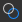

# ビットマップペイントツール

このページでは、互換性のあるビットマップの[2Dビュー](../../../interface/2d-view/2d-view.md)パネルで使用できるペイントツールについて説明します。

{width="512px"}

## 概要

[2Dビュー](../../../interface/2d-view/2d-view.md)パネルには、基本的なビットマップペイントツールが用意されており、アプリケーション内で直接画像&#x200B;*手動*&#x200B;で画像を作成または編集できます。 これらのツールは、*マスク*&#x200B;をすばやくペイントする場合などに特に便利です。

これらのツールは、*筆圧*&#x200B;などのペン入力をサポートしています。 ペンディスプレイを利用するには、[2Dビュー](../../../interface/2d-view/2d-view.md)パネルのドッキングを[解除](../../../interface/customizing-your-wor/customizing-your-workspace.md)し、配置して、ペイントに適した任意の構成にサイズ変更します。

編集は、*個別に取り消し*&#x200B;できます。画像を編集している間、[ヒストグラム](../../../interface/2d-view/2d-view.md)パネル、[タイル表示](../../../interface/2d-view/2d-view.md)、[背景画像](../../../interface/2d-view/2d-view.md)など、2Dビューパネルのその他すべての機能は&#x200B;*利用*&#x200B;できます。

>[!IMPORTANT]
>
> *のみ*&#x200B;を[新規または読み込み](../../../resources/importing-linking-and-new/importing-linking-and-new-resources.md)の&#x200B;*8ビット* [ビットマップリソース](../../../resources/bitmap-resource/bitmap-resource.md)にペイントできます。

>[!WARNING]
>
> **Windowsのみ**
> 
> タブレットユーザーは、最も信頼性の高いエクスペリエンスを実現するために、次のページで説明されている設定を適用する必要があります： [ペンとタブレットの構成](https://docs.substance3d.com/display/SPDOC/Configuring+Pens+and+Tablets)

{width="512px"}

## ペイントツールの有効化

ビットマップに関する次の条件が満たされると、[2Dビュー](../../../interface/2d-view/2d-view.md)パネルでペイントツールが自動的に有効になります。

* ビットマップは[新規またはインポートされた](../../../resources/importing-linking-and-new/importing-linking-and-new-resources.md)リソースです
* ビットマップは&#x200B;*8ビット*&#x200B;精度です
* ビットマップが[2Dビュー](../../../interface/2d-view/2d-view.md)パネルに表示されます

*新しい*&#x200B;ビットマップは、次の方法で作成できます：

* [エクスプローラー](../../../interface/the-explorer-window/the-explorer-window.md)パネルで、*SBSパッケージ*&#x200B;のRMBまたはパッケージ内の&#x200B;*フォルダー*&#x200B;をクリックしてコンテキストメニューを開き、<b>新規</b>サブメニューを開いて、<b>ビットマップ</b>オプションを選択します
* [グラフ](../../../interface/the-graph-view/the-graph-view.md)で、[ビットマップノード](../../../compositing-graphs/nodes-reference-for-com/atomic-nodes/bitmap/bitmap.md)を作成し、コンテキストメニューの<b>新しいリソースから…</b>オプションを選択します

<b>新しいビットマップ</b>ウィンドウが開き、新しいビットマップリソースの&#x200B;*名前*、*解像度*&#x200B;および&#x200B;*背景色*&#x200B;を設定できます。

>[!NOTE]
>
> *新しい*&#x200B;ビットマップリソース&#x200B;*常に*&#x200B;は&#x200B;*RGBA*&#x200B;色で、*8ビット*&#x200B;精度です。

>[!WARNING]
>
> ペイントツールのパフォーマンスを最大限に高めるために、解像度が&#x200B;*2の累乗*&#x200B;のビットマップ（128、256、512、1024など）を使用することをお勧めします。

## ツールバー

ペイントツールとオプションは、[2Dビュー](../../../interface/2d-view/2d-view.md)パネルの&#x200B;*ツールバー*&#x200B;に配置されています。 これらのツールバーは、*ハンドル*&#x200B;を<b>LMB</b>でクリックして押したままにすると、*パネルの任意の側*&#x200B;に移動したり、*フローティングツールバー*&#x200B;として移動したりできます（3行で表示）。次に、目的の場所で<b>LMB</b>を離します。

ペイントツールが有効になっている場合、[ツール選択ツールバー](#bitmappaintingtools-toolselectiontoolbar)とツールオプションツールバーの2つのツールバーが表示されます。これらのツールバーについて以下に説明します。

## ツール選択ツールバー

ペイントツールは&#x200B;**ツール選択ツールバー**&#x200B;にあります。このツールバーは、初期設定では[2D ビュー](../../../interface/2d-view/2d-view.md)パネルの&#x200B;*左側*&#x200B;に配置されています。 キーボードショートカットを使用すると、これらのツールにすばやくアクセスでき、ツール/関数名の後ろにかっこで囲まれた以下のマークが付きます。

 <b>カラー選択</b> <b>サムネイル：</b> *プライマリ*&#x200B;および&#x200B;*セカンダリ*&#x200B;の色を定義できます。 これらのサムネイルのいずれかをクリックすると、<b>カラーエディター</b>ウィンドウが表示され、色を定義できます。 ツールは&#x200B;*プライマリ*&#x200B;色を使用します。 プライマリとセカンダリの色はいつでも&#x200B;*交換* (<b>X</b>)できます

 <b>ブラシツール(B):</b> [ツールオプション]ツールバーで定義されたオプションを使用して、ペンヒントまたは<b>LMB</b>ボタンが押されたときに、カーソルの場所に&#x200B;*プライマリ*&#x200B;色を適用します

 <b>スタンプツール(T):</b>画像の一部を別の部分にスタンプできます。 <b>Alt</b>キーを押しながら<b>LMB</b>をクリックすると、スタンプする&#x200B;*ソース*&#x200B;を定義できます。 ツールオプションツールバーで定義されたオプションを使用して、ペンヒントまたは<b>LMB</b>ボタンが押されると、画像のこの領域は、カーソル位置の&#x200B;*target*&#x200B;領域にスタンプされます。 ソースがターゲットの動きを&#x200B;*追跡*&#x200B;し、*ソース*&#x200B;領域のサイズが&#x200B;*ブラシ*&#x200B;のサイズと&#x200B;*一致*&#x200B;することに注意してください

 <b>アラインメントを有効にする（スタンプツールオプション）:</b>新しいスタンプの開始時にソースを&#x200B;*同じ場所に留める*&#x200B;か、または新しいスタンプの場所に対してソースを&#x200B;*相対的に再配置させる*&#x200B;かを指定できます

<b> 消しゴム (E):</b> [ツールオプション]ツールバーで定義されているオプションを使用して、ペンヒントまたは<b>LMB</b>ボタンが押されたときに、現在の色がカーソルの位置の値(0, 0, 0, 0)に置き換えられます。 [透明表示](../../../interface/2d-view/2d-view.md)が有効になっていることを確認して、このツールが<b>Alpha</b>チャンネルに与える影響を追跡してください。

## ツールオプションツールバー

[ツール選択ツールバー](#bitmappaintingtools-toolselectiontoolbar)で使用可能なツールのオプションは、[2D ビュー](../../../interface/2d-view/2d-view.md)パネルの&#x200B;*上面*&#x200B;に既定で配置されているツールオプションツールバーにあります。

<table>
<tr style="border: 0;">
<td style="border: 0;" valign="top">

### ブラシ選択

 <b>ブラシ選択</b>を使用すると、使用可能なブラシ&#x200B;*プリセット*&#x200B;から&#x200B;*事前設定済み*&#x200B;のブラシを選択し、<b>サイズ</b>と<b>硬さ</b> *（*&#x200B;ブラシエディターの<b>シェイプ</b>セクションを参照）を設定して、ブラシストロークの*プレビュー*を表示できます。

ブラシプリセットは、ブラシエディターで作成および編集し、*ライブラリ*&#x200B;に配置できます。 このパネルに表示されるブラシプリセットは、読み込まれているすべてのブラシプリセットライブラリの&#x200B;*合計*&#x200B;です。 これらのライブラリは、 <b>ブラシライブラリ</b>メニューにアクセスして管理できます（ブラシエディターの<b>プリセット</b>セクションを参照）

 <b>背景色を選択</b>ボタンを使用すると、*ブラシストロークプレビュー*&#x200B;の背景色を変更できます。

</td>
<td style="border: 0;" valign="top">

</td>
</tr>
</table>

<table>
<tr style="border: 0;">
<td style="border: 0;" valign="top">

### ブラシエディター

 <b>ブラシエディター</b>では、ブラシの動作を定義する詳細なオプションにアクセスできます。

<b>プリセット</b>

ブラシをカスタマイズして<b>ブラシプリセット</b>として保存すると、 <b>ブラシプリセットリスト</b>と <b>ブラシ選択</b>パネルで使用できます。

プリセットを作成するには、以下のプロパティを好みに合わせて設定し、 <b>「ブラシプリセットを追加」 </b>ボタンをクリックして、<b>プリセット名</b>ウィンドウでブラシ名を設定します。 新しいプリセットは、<b>ブラシプリセットリスト</b>で自動的に選択されるようになり、現在の新しい設定でいつでも <b>更新</b>したり、 <b>削除</b>したりできます。

プリセットは、*ライブラリ*&#x200B;に整理されて保存されます。このライブラリは、 <b>ブラシライブラリ</b>メニューで管理できます。

<b>ライブラリのエクスポート：</b> 現在のプリセットとそのすべての設定をライブラリファイルに&#x200B;*保存*

<b>ライブラリのインポート：</b> 既存のライブラリファイルから&#x200B;*読み込み*&#x200B;個のプリセットを読み込み、現在のリストに&#x200B;*追加*&#x200B;します。*同じ名前のプリセットは、ライブラリファイルのものと置き換えられます*

<b>ライブラリのリセット：</b>は、現在のプリセットを既定のライブラリにリセットします

<b>ライブラリの置き換え：</b> 既存のライブラリファイルから&#x200B;*プリセットを読み込み*、現在のリストから&#x200B;*プリセットを閉じる*

</td>
<td style="border: 0;" valign="top">

</td>
</tr>
</table>

#### ブラシ設定

ブラシの設定は、次のセクションにグループ化されています。

+++シェイプ
<b>シェイプの種類</b>パラメーターは、ブラシの基本的なシェイプを制御します。 使用可能なシェイプは次のとおりです。

* *楕円*：既定では&#x200B;*円*&#x200B;として設定された丸い図形です

* *長方形*：既定では、*正方形*&#x200B;として設定された直線シェイプです

* *多角形*: *カスタマイズ可能*&#x200B;な数の稜線と角度を持つ直線シェイプです

<b>エッジ数</b>（*ポリゴン*&#x200B;図形のみ）：多角形の&#x200B;*面*&#x200B;の数を選択できます

<b>内半径</b>（*多角形*&#x200B;図形のみ）：面&#x200B;*中点*&#x200B;と図形の中心の間の距離を制御し、*星*&#x200B;パターンを効果的に作成します

<b>硬さ</b>：図形の&#x200B;*フェード半径*&#x200B;を定義します

+++

+++変形
画像にブラシストロークを適用する場合、ストロークは、このセクションのコントロールで定義された動作に従って、事実上、ブラシパターンの繰り返しのスタンプです。

<b>サイズ</b>:ブラシシェイプの&#x200B;*直径*&#x200B;をピクセル単位で設定します

<b>サイズのジッター</b>:スタンプごとのブラシサイズを&#x200B;*ランダム化*&#x200B;でき、<b>Size</b>値の&#x200B;*パーセント*&#x200B;として表され、<b>0</b>から<b>Size</b>値までのランダム値の&#x200B;*範囲*&#x200B;を制御します

<b>サイズ制御</b>: *ペン圧力*&#x200B;をサポートするペン入力を使用する場合、このパラメーターを使用してブラシサイズを制御できます

<b>間隔</b>:ブラシストロークに沿った個々のスタンプ&#x200B;*間の間隔*&#x200B;を制御します。 これにより、シェイプパターンをより明確に区別して定義することができます

<b>丸み</b>: <b>図形</b>セクションで選択されている<b>図形の種類</b>の幅とHeightの比率は、既定では&#x200B;*1:1*&#x200B;です。 このパラメーターを使用すると、Heightに対する&#x200B;*幅を低くする*&#x200B;ことで、この比率を変更できます

<b>丸みジッター</b>:スタンプごとにラウドネスを&#x200B;*ランダム化*&#x200B;でき、<b>丸み</b>の&#x200B;*パーセント*&#x200B;の値で表され、<b>0</b>から<b>ラウドネス</b>までのランダム値の&#x200B;*範囲*&#x200B;を制御します

<b>角度</b>:ブラシパターンの&#x200B;*回転*&#x200B;を&#x200B;*度*&#x200B;で制御します

<b>角度のジッター</b>:スタンプごとに回転を&#x200B;*ランダム化*&#x200B;できます。<b>角度</b>の値の&#x200B;*パーセント*&#x200B;として表され、ランダムな値の&#x200B;*範囲*&#x200B;を<b>0</b>から<b>360 </b>度制御します

+++

+++散布
デフォルトでは、シェイプパターンは厳密に線に沿ってスタンプされます。 これを混乱させるには、シェイプパターンにオフセットを適用し、ストロークの周りに散乱させて、より有機的な、または無秩序な効果を生み出します。

<b>散乱</b>：個々のスタンプをストロークからオフセットする最大&#x200B;*距離*&#x200B;で、*ブラシサイズ*&#x200B;のパーセンテージで表されます。 この距離は、ブラシサイズの<b>0</b>から設定した&#x200B;*パーセント*&#x200B;までのデフォルトでは&#x200B;*ランダム化*&#x200B;であり、オフセットの&#x200B;*方向*&#x200B;もランダムであることに注意してください

<b>カウント</b>：個々のスタンプの分散コピーの数

+++

+++カラー
ブラシによって適用される色は、*選択した原色*&#x200B;と、現在適用されている<b>ブラシテクスチャ</b>によって定義されます。 このカラーは、このセクションのコントロールを使用して動的に変更できます。

<b>フロージッター</b>:スタンプごとのフローを&#x200B;*ランダム化*&#x200B;できます。最大フローの&#x200B;*パーセント*&#x200B;で表されます

<b>フロー制御</b>: *ペン圧力*&#x200B;をサポートするペン入力を使用する場合、このパラメーターを使用してフローを制御できます

<b>色相のジッター</b>:スタンプごとの色相&#x200B;*オフセット*&#x200B;を&#x200B;*ランダム化*&#x200B;できます。色相は、全色相スパンの&#x200B;*パーセント*&#x200B;で表されます

<b>彩度のジッター</b>:スタンプごとの色の彩度&#x200B;*オフセット*&#x200B;を&#x200B;*ランダム化*&#x200B;でき、彩度スパン全体の&#x200B;*パーセント*&#x200B;として表します

<b>明るさのジッター</b>:スタンプごとの色の明るさ&#x200B;*オフセット*&#x200B;を&#x200B;*ランダム化*&#x200B;でき、全体の明るさスパンの&#x200B;*パーセント*&#x200B;として表します

+++

+++テクスチャ
ブラシに&#x200B;*ビットマップファイル*&#x200B;を適用し、単色の代わりにそのビットマップを&#x200B;*スタンプ*&#x200B;するために使用できます。 ブラシテクスチャは次のように動作します。

<b>テクスチャファイル： </b>ブラシテクスチャとして使用するビットマップの&#x200B;*パス*&#x200B;を定義します。 入力フィールドの横にあるボタンを使用すると、システムファイルブラウザからビットマップを選択できます

テクスチャ *のみ*&#x200B;はブラシの基本の単色に置き換わります。つまり、前述の&#x200B;*すべてのブラシプロパティを引き続き使用して*&#x200B;説明どおりに機能できます

テクスチャの色は、*色相シフト*&#x200B;して&#x200B;*原色を設定*&#x200B;に向かっています。つまり、設定された原色が白の場合、テクスチャの色をそのまま使用できます。 設定した原色の彩度が高いほど、テクスチャの色を近くに色相シフトできます

+++

### 不透明度/流量

ブラシツール、スタンプツール、消しゴムツールでは、<b>不透明度</b>と<b>流量</b>を制御できます。

<b>不透明度</b>は、スタンプの&#x200B;*最大の不透明度*&#x200B;を制御します。 個別のストロークに対して&#x200B;*加算*&#x200B;されます。つまり、領域の不透明度は、その領域で複数の&#x200B;*個別*&#x200B;ストロークを実行することで、最大100%に戻すことができます

<b>流量</b>は、任意の時点で適用される&#x200B;*ツールの効果の量*&#x200B;を制御します。 これは、同じストロークに&#x200B;*加算*&#x200B;されます。つまり、領域の&#x200B;*同じストローク*&#x200B;の複数のパス、または複数の個別のストロークを実行することで、領域の不透明度を最大100%に戻すことができます。

<table>
<tr style="border: 0;">
<td width="100.00%" style="border: 0;" valign="top">

### タイリングモード

ブラシツール、スタンプツール、消しゴムツールでも、 <b>タイリングモード</b>を設定できます。このモードでは、ストロークが画像の境界の外側の領域に影響を与えるときに、画像の反対側に&#x200B;*ループバック*&#x200B;する機能が定義されます。

<b>タイリングXおよびY</b>:ブラシストロークタイル&#x200B;*水平および垂直方向の両方*

<b>タイリング X</b>:ブラシストロークタイル&#x200B;*水平のみ*

<b>タイリングY</b>:ブラシストロークタイル&#x200B;*垂直方向のみ*

<b>タイリングなし</b>:ブラシストローク&#x200B;*並べて表示しない*

</td>
<td width="25.00%" style="border: 0;" valign="top">

</td>
</tr>
</table>
