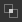

# ベクター編集ツール

このページでは、互換性のあるベクターグラフィックの[2Dビュー](https://docs.substance3d.com/display/SDDOC/2D+view)パネルで使用できる編集ツールについて説明します。

## 概要

<table>
<tr style="border: 0;">
<td style="border: 0;" valign="top">

[2Dビュー](https://docs.substance3d.com/display/SDDOC/2D+view)パネルには、基本的なベクター編集ツールが用意されており、[Substance 3D Designer](https://www.adobe.com/jp/products/substance3d-designer.html)内でベクターグラフィックを&#x200B;*手動*&#x200B;で直接作成または編集できます。 これらのツールは、例えば、*マスク*&#x200B;や&#x200B;*パターン*&#x200B;をすばやく作成する場合に特に便利です。

これらのツールはペン入力をサポートしています。 ペンディスプレイを利用するには、[2Dビュー](https://docs.substance3d.com/display/SDDOC/2D+view)パネルのドッキングを[解除](https://docs.substance3d.com/display/SDDOC/Customizing+your+workspace)し、配置して、ペイントに適した任意の構成にサイズ変更します。

編集は&#x200B;*個別に取り消し*&#x200B;できます。ベクター画像（[ヒストグラム](https://docs.substance3d.com/display/SDDOC/2D+view#id-2Dview-Histogram)パネル、[タイル表示](https://docs.substance3d.com/display/SDDOC/2D+view#id-2Dview-Viewport)、[背景画像](https://docs.substance3d.com/display/SDDOC/2D+view#id-2Dview-Backgroundimage)など）を編集する間、2Dビューパネルのその他すべての機能は引き続き&#x200B;*利用できます*。

</td>
<td style="border: 0;" valign="top">

{width="512px"}

</td>
</tr>
</table>

>[!TIP]
>
> **Windowsのみ**
> 
> Designerで最も信頼性の高い操作を行うには、タブレットユーザーは次のページに記載されている設定を適用する必要があります： [ペンとタブレットの構成](https://docs.substance3d.com/display/SPDOC/Configuring+Pens+and+Tablets)

>[!IMPORTANT]
>
> [新規または読み込み](https://docs.substance3d.com/display/SDDOC/Importing%2C+Linking+and+New+Resources)の&#x200B;*8ビット* [ベクターグラフィックリソース](../../../resources/vector-graphics-svg-res/vector-graphics-svg-resource.md)には、*のみ*&#x200B;をペイントできます。

{width="512px"}

## ベクター編集ツールの有効化

ベクター編集ツールは、ベクターグラフィック画像に関する次の基準が満たされると、[2Dビュー](https://docs.substance3d.com/display/SDDOC/2D+view)パネルで自動的に有効になります。

* ベクターグラフィック画像は[新規またはインポートされた](https://docs.substance3d.com/display/SDDOC/Importing%2C+Linking+and+New+Resources)リソースです
* ビットマップが[2Dビュー](https://docs.substance3d.com/display/SDDOC/2D+view)パネルに表示されます

*新しい*&#x200B;ベクターグラフィック画像は、次の方法で作成できます。

* [エクスプローラー](https://docs.substance3d.com/display/SDDOC/The+Explorer+Window)パネルで、*SBSパッケージ*&#x200B;の人民元をクリックするか、パッケージ内の&#x200B;*フォルダー*&#x200B;をクリックして、コンテキストメニューを開きます。次に、**新規**&#x200B;サブメニューを開き、「**SVG**」オプションを選択します
* [グラフ](https://docs.substance3d.com/display/SDDOC/The+Graph+view)で、[リソースノード](../../../compositing-graphs/nodes-reference-for-com/atomic-nodes/svg/svg.md)を作成し、コンテキストメニューの&#x200B;**新しいSVGから…**&#x200B;オプションを選択します

**新しいベクターデータ**&#x200B;ウィンドウが開き、新しいベクターグラフィックリソースの&#x200B;*名前*&#x200B;と&#x200B;*解像度*&#x200B;を設定できます。

>[!TIP]
>
> ベクター編集ツールで最高のパフォーマンスを得るには、*2の累乗*&#x200B;の解像度（128、256、512、1024など）のベクターグラフィック画像を使用することをお勧めします。

### 他のソフトウェアからのベクターグラフィックの書き出し

Designer *のみ*&#x200B;は、**SVG**&#x200B;ファイル形式を使用するベクターグラフィックをサポートします。

Designerとその編集ツールの互換性と信頼性を最大限に高めるため、すべてのオブジェクトが&#x200B;*アウトライン*&#x200B;に変換され、*単色*&#x200B;を使用して&#x200B;*個別*&#x200B;のオブジェクトにグループ化が解除されていることを確認して、*以下が残らないようにしてください*:

* **テキスト**
* **グラデーション**
* **パターン** （塗りと線のアウトライン）
* **スタイル**

**Adobe Illustrator**&#x200B;のユーザーは、添付された画像を参照して、推奨されるSVG *書き出し設定*&#x200B;を利用できます。

+++Adobe Illustrator書き出しオプション

+++

>[!NOTE]
>
> DesignerでのSVGの制限、他のソフトウェアからの書き出し、およびSVGプロパティの詳細については、[ベクターグラフィックス(SVG)リソース](../../../resources/vector-graphics-svg-res/vector-graphics-svg-resource.md)を参照してください。

## ツール

ペイントツールとオプションは、[2Dビュー](https://docs.substance3d.com/display/SDDOC/2D+view)パネルの&#x200B;*ツールバー*&#x200B;に配置されています。 これらのツールバーは、*ハンドル*&#x200B;を&#x200B;**LMB**&#x200B;でクリックして押したままにすると、*パネルの任意の側*&#x200B;に移動したり、*フローティングツールバー*&#x200B;として移動したりできます（3行で表示）。次に、目的の場所で&#x200B;**LMB**&#x200B;を離します。

ベクター編集ツールが有効になっている場合、2つのツールバーが表示されます。

* **ツール選択** **ツールバー**: *ツール*&#x200B;と&#x200B;*塗りつぶし/アウトラインの色*&#x200B;を選択できます。既定では2Dビューパネルの&#x200B;*左*&#x200B;側に配置されます
* **ツールオプションツールバー**: *現在選択されているツール*&#x200B;の&#x200B;*オプション*&#x200B;を設定できます。デフォルトでは、2Dビューパネルの&#x200B;*上*&#x200B;に配置されます

キーボードショートカットを使用するとツールにすばやくアクセスでき、ツール/関数名の後の括弧で囲まれた以下のマークが付きます。

+++カラー選択
 **カラー選択** *サムネール*&#x200B;では、ベクターシェイプの&#x200B;*塗りつぶし*&#x200B;と&#x200B;*アウトライン*&#x200B;の色を定義できます。 次の方法で、各色の&#x200B;**カラーエディター**&#x200B;を開くことができます。

* **塗りつぶしの色：** *塗りつぶし*&#x200B;のカラーサムネール（上）をクリックするか、カンバス上のLMBをダブルクリックします

* **アウトラインの色：** *アウトライン*&#x200B;の色のサムネイル（下）をクリックするか、*Ctrl*&#x200B;を押しながらカンバス上のLMBをダブルクリックします

設定した色は、*現在選択されている図形*&#x200B;に適用されます。

現在の&#x200B;*アウトライン*&#x200B;の色が&#x200B;*黒*&#x200B;である場合(つまり、輝度0またはRGB(0, 0, 0))、アウトラインの色サムネール&#x200B;*を*&#x200B;クリックするまで、選択した図形に&#x200B;*適用されません*&#x200B;が。

+++

+++変形
{width="512px"}

 <b>変換</b>ツール(<b>V</b>)では、図形を選択して変換ギズモに含めることができます。 このギズモを使用すると、次の操作を実行できます。

<b>移動</b>:ギズモの&#x200B;*内側*&#x200B;をクリックして長押しします

<b>拡大・縮小</b>:ギズモに沿った&#x200B;*正方形のハンドル*&#x200B;のいずれかをクリックしてLMBを押したままにすると、オブジェクトが水平、垂直、またはその両方に&#x200B;*拡大・縮小*&#x200B;されます。 デフォルトでは、ギズモの&#x200B;*反対側*&#x200B;のハンドルに対して相対的に拡大/縮小が実行されます。 <b>Alt</b>キーを押したままにすると、ギズモの&#x200B;*中心*&#x200B;に対して相対的にスケーリングされ、<b>Shift</b>キーを押したままにすると、ギズモの幅/Height *縦横比*&#x200B;を&#x200B;*ロック*&#x200B;できます

<b>回転： </b>ギズモの&#x200B;*外側*&#x200B;にある&#x200B;*正方形のハンドル*&#x200B;の横でLMBを押したままにします。

+++

+++ノード
{width="512px"}

 <b>ノード</b>ツール(<b>A</b>)を使用すると、選択した図形の個々の頂点（ノード）を選択し、その位置とハンドルを編集したり、頂点を追加および削除したりできます。 シェイプを選択すると、次のアクションを実行できます。

<b>頂点の追加：</b>シェイプのアウトラインにCtrl + LMB

<b>頂点を削除</b>：頂点のCtrl + LMB

<b>頂点を移動</b>：頂点のLMBを押したままにします

<b>頂点ハンドルの移動</b>:ハンドルのLMBを押したままにします

<b>頂点ハンドルを個別に移動する</b>: Alt + LMBを押したままにします。 ハンドルは、*リセット*&#x200B;されるまで、このポイントを超えると&#x200B;*リンク解除*&#x200B;されます

<b>ハンドルのリセット</b>：頂点でAlt + LMBをクリックします。 ハンドルが&#x200B;*頂点の位置*&#x200B;にリセットされます

<b>頂点のリセットハンドルを移動します</b>：頂点の上でAlt + LMBを押したままにします。 *リンク*&#x200B;のハンドルが表示されます

+++

+++シェイプ
{width="512px"}

 <b>シェイプ</b>ツール(<b>M</b>)は、現在の&#x200B;*塗りつぶし*&#x200B;の色を使用したプリミティブなシェイプのセットを提供しています。この色は、次のものから構築および編集できます。

* <b>長方形；</b>

* <b>楕円；</b>

* <b>角丸長方形：</b>角丸角度の半径がロックされています。

* <b>多角形：</b>八角形を作成します。

プリミティブを描画するには、カンバス内の&#x200B;*隅*&#x200B;のいずれかの場所で<b>LMB</b>を押したままにします。 <b>Alt + LMB</b>を押し続けて、*中心*&#x200B;から図形を描画します。

+++

+++ペン
{width="512px"}

 <b>ペン</b>ツール(<b>P</b>)を使用すると、現在の&#x200B;*塗りつぶし*&#x200B;の色を使用して新しいユーザー設定の図形を描画できます。 次の2つのモードを使用できます。

<b>パス</b>モードでは、図形は一度に&#x200B;*1つの頂点*&#x200B;を描画します。 次のコントロールを使用できます。

<b>直線イン/直線アウト</b>頂点を追加： LMBをクリック

<b>カーブイン/カーブアウト</b>頂点（*調整された*&#x200B;接線）を追加： LMBを押したままドラッグ

<b>トーンカーブイン/トーンカーブアウト</b>頂点（*未調整*&#x200B;接線）\*: LMBを押したままドラッグし、Alt + LMBを押します

<b>カーブイン/ストレートアウト</b>頂点\*を追加：カーブイン/カーブアウト頂点（未調整の接線）と同じですが、アウトラインは新しい頂点の上*&#x200B;に配置する必要があります*

<b>直線イン/カーブアウト</b>頂点\*を追加： Alt + LMBを押しながらドラッグ

<b>次の&#x200B;*頂点の図形を閉じる</b>: Ctrlキーを押したままにします*

<b>現在の&#x200B;*頂点の図形</b>を閉じる： Enterキーを押すか、現在の図形の*&#x200B;最初の頂点&#x200B;*で[LMB]をクリックします*

<b>フリーハンド</b>モードでは、LMBを押しながらペンをカンバス上にドラッグして、直接シェイプを描画できます。

頂点は、線に沿って&#x200B;*自動的に配置*&#x200B;され、結果のパスが線にできるだけ近づくようにします。 ストロークが終了すると、シェイプは&#x200B;*自動的に閉じる*&#x200B;になり、最初の頂点がストロークの最後に接続されます。

+++

+++押し出し
{width="512px"}

 **押し出し**&#x200B;ツール(E) *は、*&#x200B;直径を設定&#x200B;*した形状を*&#x200B;合わせ、*描画モード*&#x200B;で選択したパスに沿って描画し、オプションツールバーで設定した&#x200B;*結合モード*&#x200B;に従ってキャンバスに結果を適用します。

次の&#x200B;*描画モード*&#x200B;を利用できます：

 **フリーフォーム**: LMBを押したまま、キャンバス上でペンをドラッグ&#x200B;*して、シェイプ*&#x200B;を直接描画します。 ストロークが終了すると、シェイプが一緒に追加されます。

 **多角形**: LMBをクリックして角度を追加することにより、シェイプ&#x200B;*一度に1つの面*&#x200B;を描画します。 Enterキーを押すと、シェイプが一緒に追加されます。

描画されたシェイプは、次のパラメーターを使用して制御できます。

<b>サイズ</b>:カーソル位置に描画される放射状シェイプの直径を制御します。

<b>Smoothness</b>：ストロークの最後に一緒に追加したときの、描画されたシェイプの滑らかさ&#x200B;*および単純化*&#x200B;の量を制御します。

描画が完了すると、次のいずれかの&#x200B;*結合モード*&#x200B;を使用して図形が追加され、現在選択されている図形と結合されます。

 **結合なし**：図形は、選択した図形の&#x200B;*上*&#x200B;に&#x200B;*別のオブジェクト*&#x200B;として描画されます。

 **結合**：図形は&#x200B;*選択した図形に追加*&#x200B;されています。

 **減算**：図形は、選択した図形の&#x200B;*切り抜き*&#x200B;です。

 **交差点**：新しい図形および選択した図形の&#x200B;*重なり合う*&#x200B;部分のみが残ります。

+++

## シェイプの操作

{width="512px"}

上記のツールに加えて、RMBをクリックすると表示されるコンテキストメニューを使用して、*選択した図形*&#x200B;に対して多くの操作を実行できます。 これらの操作には、ほとんどの場合、キーボードショートカット（以下の括弧内に示す）が次のカテゴリにまとめられています。

+++シェイプの追加と削除
<b>選択範囲をコピー</b> (Ctrl + C): *選択した図形をクリップボードにコピー*

<b>選択範囲を切り取り</b> (Ctrl + X): *選択した図形をクリップボードにコピー*&#x200B;し、図形を&#x200B;*削除*&#x200B;します

<b>貼り付け</b> (Ctrl + V):クリップボードの&#x200B;*カーソル位置*&#x200B;に現在コピーされている図形を作成します

<b>貼り付け</b> (Ctrl+Shift+V):クリップボード内のコピーされた図形を&#x200B;*コピーされた図形の場所*&#x200B;に作成します

<b>選択範囲を削除</b> (Del): *選択した図形を削除*

+++

+++シェイプの配置
シェイプは&#x200B;*スタック*&#x200B;に配置されます。これにより、キャンバス内のシェイプの&#x200B;*順序*&#x200B;が設定されます（上に配置されます）。 新しい図形は、既定でキャンバスの&#x200B;*上*&#x200B;に作成されます。次のコントロールを使用すると、この配置を変更できます。

<b>前面へ</b> （ホーム）: *選択した図形を上へ*&#x200B;して、図形スタックの&#x200B;*上*&#x200B;に移動します

<b>前面へ</b> (PgUp): *選択した図形を上へ* 1レベル&#x200B;*移動*&#x200B;します

<b>背面へ</b> (PgDown): *下へ*&#x200B;選択した図形を下へ&#x200B;*1レベル*&#x200B;移動します

<b>背面へ</b> （最後）: *下へ*&#x200B;選択した図形を図形スタックの&#x200B;*下へ*&#x200B;移動します

+++

+++新しいSVG画像に送信
現在の画像の図形を使用して、現在の[SBSパッケージ](../../../getting-started/overview/overview.md)に&#x200B;*新しい[SVGリソース](../../../resources/vector-graphics-svg-res/vector-graphics-svg-resource.md)*&#x200B;を作成できます。 この点に関して、以下のアクションが可能です。

<b>選択範囲を新しいSVGにコピー</b>：新しいSVGリソースを作成し、選択した図形&#x200B;*をこの新しい画像の場所*&#x200B;にコピーします。

<b>選択範囲を新しいSVGに切り取り</b>：新しいSVGリソースを作成し、選択した図形&#x200B;*をこの新しい画像にコピー*&#x200B;して、*現在の画像*&#x200B;から&#x200B;*削除*&#x200B;します。

+++
