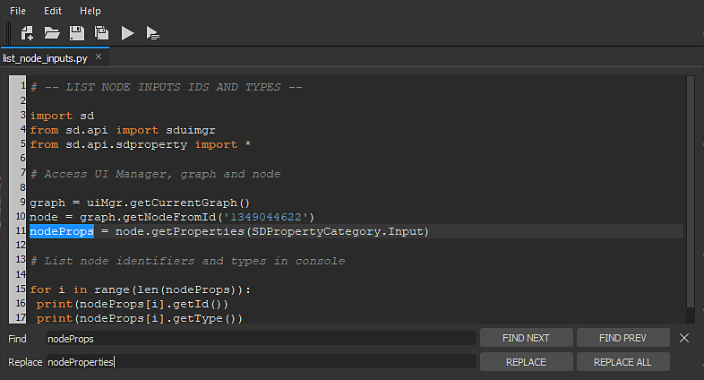

# Python エディター

Substance 3D Designerには&#x200B;**スクリプトエディター**&#x200B;が含まれており、ユーザーはDesigner内で&#x200B;**Pythonコードを直接テスト**&#x200B;し、**コンソール出力**&#x200B;を取得できます。

エディターには&#39;**検索と置換**&#39;機能があり、エディターメニューバーの&#39;*編集/検索…*&#39;アイテムで、または&#x200B;*Ctrl + F*&#x200B;を押すことでアクセスできます。

Python Editorの&#x200B;**testing** **purpose**&#x200B;の精神では、ユーザーはエディターツールバーの&#39;*Run*&#39;ボタンを押す（または&#x200B;*F5*&#x200B;キーを押す）ことによって、または&#39;*Run Selection*&#39;ボタンを押す（または&#39;*Ctrl + Enter*&#39;キーを押す）ことによって&#x200B;**現在の選択のみ**&#x200B;を、テストできます。

