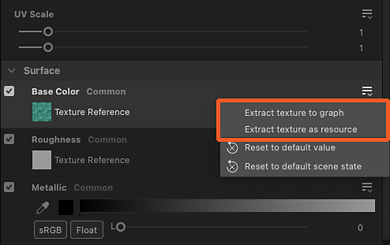

# マテリアルの値とテクスチャの抽出

マテリアルのプロパティを抽出して、Substanceグラフで使用できます。

<table>
<tr style="border: 0;">
<td style="border: 0;" valign="top">

## テクスチャからの新しいグラフ

</td>
<td style="border: 0;" valign="top">

### テクスチャを抽出

</td>
<td style="border: 0;" valign="top">

### 値を抽出

</td>
</tr>
</table>

## テクスチャからの新しいグラフ

「テクスチャ入力からグラフを作成」アクションを使用すると、マテリアルで使用されているすべてのテクスチャを含む新しいSubstanceグラフが作成されます

このアクションを使用すると、いくつかの処理が行われます。

* 選択した場所にマテリアルにちなんだ名前のSubstanceグラフが作成されます。
* [ビットマップリソース](../../resources/bitmap-resource/bitmap-resource.md)は、マテリアルで使用されるすべてのテクスチャに対して作成され、&#39;Resources&#39;フォルダーの下の、マテリアルにちなんだ名前のフォルダーに配置されます。
* グラフでは、これらのビットマップリソースごとに[ビットマップ](../../compositing-graphs/nodes-reference-for-com/atomic-nodes/bitmap/bitmap.md)ノードが作成され、テクスチャを使用して、マテリアルプロパティの後に構成された[出力](../../compositing-graphs/nodes-reference-for-com/atomic-nodes/output/output.md)ノードに自動的に接続されます。
* 同じテクスチャの各チャンネルを使用して異なるマテリアルプロパティを制御する場合（このテクニックは[チャンネルパッキング](../../glossary/glossary.md)と呼ばれます）、[グレースケール変換](../../compositing-graphs/nodes-reference-for-com/atomic-nodes/grayscale-conversion/grayscale-conversion.md)のノードが自動的に追加され、適切なチャンネルが選択されます。
* グラフは自動的にマテリアルに接続され、グラフを編集するまで外観は変わりません。

<table>
<tr style="border: 0;">
<td style="border: 0;" valign="top">

{zoomable="yes"}

*3Dビュービューポートのアクション*

</td>
<td style="border: 0;" valign="top">

{zoomable="yes"}

*マテリアルメニューのアクション*

</td>
<td style="border: 0;" valign="top">

{zoomable="yes"}

*プロパティドックのアクション*

</td>
</tr>
</table>

{zoomable="yes"}

*マテリアルテクスチャからグラフを作成した結果*

+++デモンストレーション
{zoomable="yes"}

+++

>[!TIP]
>
> オブジェクト上にカーソルを置き<b>Shift + LMB</b>を押して選択することで、3Dビュービューポートでアクションにすばやく直接アクセスできます。 次に、RMBをクリックして、アクションをホストしているコンテキストメニューにアクセスします。

>[!NOTE]
>
> *埋め込みテクスチャ*&#x200B;を使用する形式（例： USDZ）の場合、テクスチャを抽出してディスクにコピーする必要があります。 これにより、テクスチャを抽出する場所を選択するための追加ステップが実行されます。

## テクスチャを抽出

「テクスチャをグラフに抽出」アクションは、マテリアルで使用されるテクスチャの既存のグラフに新しいビットマップノードを作成します。

このアクションを使用すると、いくつかの処理が行われます。

* [ビットマップリソース](../../resources/bitmap-resource/bitmap-resource.md)は、マテリアルで使用されるテクスチャ用に作成され、&#39;Resources&#39;フォルダーの下の、マテリアルにちなんだ名前のフォルダーに配置されます。
* 選択したグラフで、[ビットマップ](../../compositing-graphs/nodes-reference-for-com/atomic-nodes/bitmap/bitmap.md)ノードがそのビットマップリソース用に作成され、そのテクスチャを使用して、マテリアルプロパティの後に構成された[Output](../../compositing-graphs/nodes-reference-for-com/atomic-nodes/output/output.md)ノードに自動的に接続されます。

マテリアルプロパティ&#x200B;*に対して構成された出力がグラフに既に存在する*&#x200B;場合、*ノードは作成されず*&#x200B;ビットマップリソースの作成のみが実行されます。

例： 「ベースカラー」プロパティのテクスチャを、「ベースカラー」用に構成された出力ノードを既にホストしているグラフに抽出すると、グラフにノードが作成されなくなります。

<table>
<tr style="border: 0;">
<td style="border: 0;" valign="top">

{zoomable="yes"}

プロパティドックのマテリアルプロパティのアクション

</td>
<td style="border: 0;" valign="top">

{zoomable="yes"}

「宛先グラフを選択」ダイアログ

</td>
<td style="border: 0;" valign="top">

</td>
</tr>
</table>

{zoomable="yes"}

テクスチャ抽出結果

+++デモンストレーション
{zoomable="yes"}

+++

「テクスチャをリソースとして抽出」アクションでは、マテリアルで使用されるテクスチャのビットマップリソースのみが作成され、「Resources」フォルダの下の、マテリアルにちなんだ名前のフォルダに配置されます。

>[!NOTE]
>
> *埋め込みテクスチャ*&#x200B;を使用する形式（例： USDZ）の場合、テクスチャを抽出してディスクにコピーする必要があります。 その結果、テクスチャを抽出する場所を選択するための追加の手順が必要になります。

## 値を抽出

&#39;値をグラフに抽出&#39;アクションは、マテリアルプロパティ値の既存のグラフに新しい[値プロセッサ](../../compositing-graphs/nodes-reference-for-com/atomic-nodes/value-processor/value-processor.md)ノードを作成します。

このアクションを使用すると、いくつかの処理が行われます。

* 選択したグラフで、そのプロパティ値に対して[Value processor](../../compositing-graphs/nodes-reference-for-com/atomic-nodes/value-processor/value-processor.md)ノードが作成され、そのマテリアルプロパティの後に構成される[Output](../../compositing-graphs/nodes-reference-for-com/atomic-nodes/output/output.md)ノードに自動的に接続されます。
* 値プロセッサノードの[Substance関数グラフ](../../function-graphs/function-graphs.md)で、値の種類に一致する[定数ノード](../../function-graphs/nodes-reference-for-fun/atomic-function-nodes/constant-nodes/constant-nodes.md)が作成され、グラフの出力として設定された抽出値に設定されます。

マテリアルプロパティ&#x200B;*に対して構成された出力がグラフに既に存在する*&#x200B;場合、*ノードは作成されません*。

例： 「異方性レベル」プロパティの値を、「異方性レベル」用に設定された出力ノードを既にホストしているグラフに抽出すると、グラフにノードが作成されなくなります。

<table>
<tr style="border: 0;">
<td style="border: 0;" valign="top">

{zoomable="yes"}

プロパティドックのマテリアルプロパティのアクション

</td>
<td style="border: 0;" valign="top">

{zoomable="yes"}

「宛先グラフを選択」ダイアログ

</td>
<td style="border: 0;" valign="top">

{zoomable="yes"}

値プロセッサノードの関数の定数ノード

</td>
</tr>
</table>

{zoomable="yes"}

値の抽出結果

+++デモンストレーション
{zoomable="yes"}

+++
