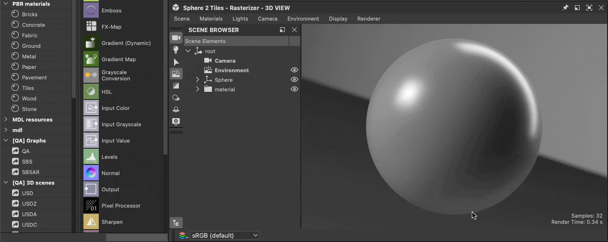
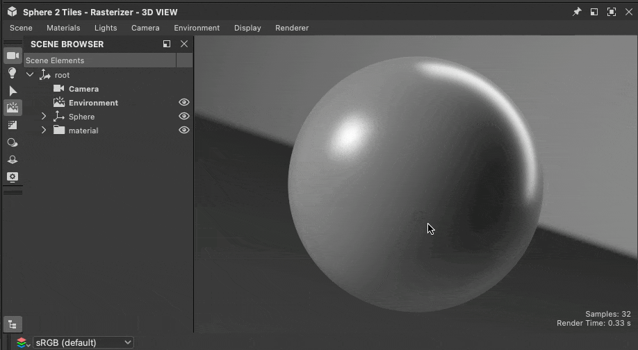

# 3Dシーンの操作

{zoomable="yes"}

Designerでは、[3Dシーン](../glossary/glossary.md)を読み込んで、コンテキストに応じてマテリアルを操作できます。 各形式でサポートされている機能のリストなど、3Dシーンでサポートされているファイル形式のリストはこちらにあります。 <b>&lt;リンクが必要です></b>

状況に応じて作業するには、シーンの[マテリアル](../glossary/glossary.md)の1つを[オーバーライド](../working-with-3d-scenes/overriding-scene-mat/overriding-scene-materials.md)して、Designerで作成されたマテリアルに置き換える必要があります。\
Designerで利用できる任意のSubstanceグラフテンプレートを使用してゼロから作成することも、3Dシーンのマテリアルを出発点として[値とテクスチャを抽出](../working-with-3d-scenes/extracting-materials-val/extracting-materials-values-and-textures.md)することもできます。

3Dシーンでの作業が完了したら、別のアプリケーションで取り込む新しいファイルに[書き出し](../working-with-3d-scenes/exporting-scenes/exporting-scenes.md)できます。

USD形式に書き出す場合。このワークフローはすべて<b>非破壊的</b>にすることができます。つまり、編集と追加のみが書き出されます。

まず、作業する3Dシーンを読み込み、セッション間でDesignerのステートを維持できる必要があります。

<table>
<tr style="border: 0;">
<td style="border: 0;" valign="top">

## 3Dシーンのコンテンツ

</td>
<td style="border: 0;" valign="top">

### シーンのロード

</td>
<td style="border: 0;" valign="top">

### シーン状態ファイル

</td>
</tr>
</table>

## 3Dシーンのコンテンツ

3Dシーンを読み込むと、Designerは独自のシーンを作成してホストします。

シーンの次のコンテンツを操作できます。

* <b>マテリアル:</b> Designerで作成されたコピーで、シーンで使用されているすべてのマテリアルを[上書き](../working-with-3d-scenes/overriding-scene-mat/overriding-scene-materials.md)できます。 そのコピーの[マテリアルプロパティ](../interface/3d-view/material-properties/material-properties.md)を、SubstanceグラフのRaw値またはテクスチャで編集できます。
* <b>メッシュ：</b>ジオメトリは、ビューポートまたは[Scene Browser](../interface/3d-view/scene-browser/scene-browser.md)から直接選択して、そのマテリアル操作（[override](../working-with-3d-scenes/overriding-scene-mat/overriding-scene-materials.md)、[reset](../working-with-3d-scenes/overriding-scene-mat/overriding-scene-materials.md)、[extract to Substanceグラフ](../working-with-3d-scenes/extracting-materials-val/extracting-materials-values-and-textures.md)）にアクセスできます
* <b>ライト:</b>シーン内のすべてのライトは、[Scene browser](../interface/3d-view/scene-browser/scene-browser.md)で無効にできます。
* <b>カメラ:</b>シーン内で検出されたすべてのカメラは、Designerによって追加されたカメラにプリセットとして追加されます。

{zoomable="yes"}

Designerは、3D シーンにUSDの説明を使用します。 そのレイアウトはScene Browserでナビゲートできます。各[USD prim](https://openusd.org/release/glossary.html#usdglossary-prim)タイプには独自のアイコン（ジオメトリ、マテリアル、シェーダ、カメラ、トランスフォームなど）があります。

[Scene Browser](../interface/3d-view/scene-browser/scene-browser.md)を使用して、シーンのコンテンツを選択、有効化、および無効化できます。 したがって、カスタム3D シーンを操作する場合は、常に表示しておくことをお勧めします。

## シーンのロード

3D ビューに3D シーンを読み込むには、いくつかの方法があります。

1. [3Dシーンリソース](../resources/3d-scene-resource/3d-scene-resource.md)をダブルクリックするか、[パッケージ](../glossary/glossary.md)から3Dビューにドラッグします
1. [ライブラリ](../interface/the-library/the-library.md)の3D シーン項目を3D ビューにドラッグします（[独自のコンテンツをライブラリに追加](../interface/the-library/managing-custom-content/managing-custom-content-and-filters.md)した場合）
1. 3D シーンファイルをシステムのファイルブラウザから3D ビューにドラッグします
1. 3D シーン・ステート・ファイル(SBSSCN)とその参照メッシュをロードします。

シーンのステータスは3D シーン・リソースおよびシーン・ステート・ファイルに書き込まれ、パッケージに保存されるため、シーンを再びロードできるのは、メソッド1と4だけです。前回の作業とまったく同じです。 方法2および3は、他の方法と同様にシーンをロードします。

<table>
<tr style="border: 0;">
<td style="border: 0;" valign="top">

{zoomable="yes"}

3Dシーンリソースの読み込み

</td>
<td style="border: 0;" valign="top">

{zoomable="yes"}

ライブラリからの3Dシーンの読み込み

</td>
</tr>
</table>

<table>
<tr style="border: 0;">
<td style="border: 0;" valign="top">

{zoomable="yes"}

3Dシーンファイルをロードする

</td>
<td style="border: 0;" valign="top">

{zoomable="yes"}

シーン状態ファイルをロードする

</td>
</tr>
</table>

>[!NOTE]
>
> 3D ビュー内のシーンのナビゲーションと視覚化については、[3D ビュードキュメント](../interface/3d-view/3d-view.md)を参照してください。

<table>
<tr style="border: 0;">
<td width="100.00%" style="border: 0;" valign="top">

Designerでは、シーンに存在する環境に加えて、常に独自の環境（USDのDomeLight）とカメラが作成されます。

Designerで作成されたアイテムは、Scene Browserに<b>太字のラベル</b>でリストされます。

>[!NOTE]
>
> 読み込まれたシーンに少なくとも1つのEnvironment (DomeLight)がある場合、Designerによって作成されたEnvironmentは、シーンのEnvironment Lightingと干渉しないようにデフォルトで&#x200B;*無効*&#x200B;になっています。

</td>
<td width="33.33%" style="border: 0;" valign="top">

{zoomable="yes"}

</td>
</tr>
</table>

## シーン状態ファイル

3Dビューでマテリアル、カメラ、ライトなどを設定した後、その状態をシーン状態ファイル(.sbscn)に保存できます。このファイルは、後でロードして状態を復元できます。 例えば、異なるタイプのマテリアルや特定の照明環境をプレビューするためにいくつかのシーンを設定することができます。

{zoomable="yes"}

保存されたシーンの状態は、3Dビューのデフォルトの状態としても使用できるため、新しい3Dビューを作成する際には、常にその状態が使用されます。 この機能は、既定値でマテリアルをSphere 2-Tilesメッシュ上でタイリング値2と特定の環境マップを使用してプレビューする場合に便利です。

シーン状態ファイルに関連するアクションは、3Dビューのシーンメニューにあり、[こちら](../interface/3d-view/3d-view.md)で説明されています。

シーン状態ファイルはXML形式を使用し、[プロジェクト設定](../interface/preferences-window/project-settings/project-settings.md)で定義されている場合は[エイリアス](../pipeline-and-project-con/project-configuration-fil/project-configuration-files-sbsprj.md)を使用します。

>[!NOTE]
>
> レンダラーはシーン状態ファイルに保存されません。
