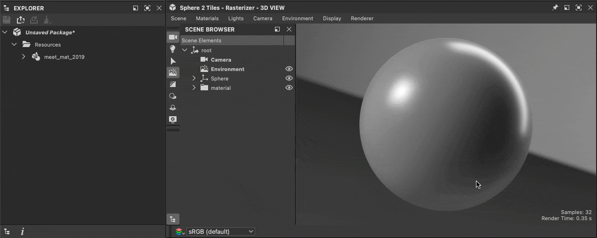
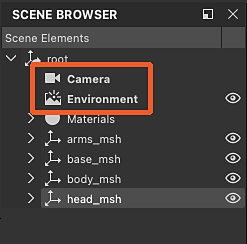

# 3D シーンの操作

{zoomable="yes"}

Designerでは、[3D シーン](../glossary/glossary.md)を読み込んで、コンテキスト内のマテリアルで作業できます。 各フォーマットでサポートされている機能のリストを含む、3Dシーンでサポートされているファイルフォーマットのリストは、こちらを参照してください。 <b>&lt;リンクが必要です></b>

コンテキストで作業するには、シーンの[マテリアル](../glossary/glossary.md)の1つを[上書き](../working-with-3d-scenes/overriding-scene-mat/overriding-scene-materials.md)して、Designerで作成されたマテリアルに置き換える必要があります。\
最初から、Designerで利用できる任意のSubstanceグラフテンプレートを使用するか、または3D シーンのマテリアルから[値とテクスチャを抽出](../working-with-3d-scenes/extracting-materials-val/extracting-materials-values-and-textures.md)して、ゼロから作成することができます。

3D シーンの処理が完了したら、別のアプリケーションで取り込む新しいファイルに[エクスポート](../working-with-3d-scenes/exporting-scenes/exporting-scenes.md)できます。

USD形式に書き出す場合。このワークフローはすべて<b>非破壊的</b>にすることができます。つまり、編集内容と追加内容のみが書き出されます。

まず、作業する3D シーンを読み込み、セッション間でDesignerのステータスを維持できるようにする必要があります。

## 3D シーンのコンテンツ

3D シーンを読み込むときに、Designerはデータをホストする独自のシーンを作成しました。

シーンの次の内容を操作できます。

* <b>マテリアル:</b>シーンで使用されているすべてのマテリアルは、Designerによって作成されたコピーで[上書き](../working-with-3d-scenes/overriding-scene-mat/overriding-scene-materials.md)できます。 そのコピーの[マテリアルのプロパティ](../interface/3d-view/material-properties/material-properties.md)をRAW値またはSubstanceグラフからのテクスチャで編集できます。
* <b>メッシュ:</b>ジオメトリは、ビューポートで直接選択するか、[シーンブラウザー](../interface/3d-view/scene-browser/scene-browser.md)から選択して、そのマテリアル操作にアクセスすることができます（[上書き](../working-with-3d-scenes/overriding-scene-mat/overriding-scene-materials.md)、[リセット](../working-with-3d-scenes/overriding-scene-mat/overriding-scene-materials.md)、[Substanceグラフに展開](../working-with-3d-scenes/extracting-materials-val/extracting-materials-values-and-textures.md)）
* <b>ライト:</b> シーン内のすべてのライトは、[シーンブラウザー](../interface/3d-view/scene-browser/scene-browser.md)で無効にできます。
* <b>カメラ:</b> シーンで検出されたすべてのカメラは、Designerによって追加されたカメラにプリセットとして追加されます。

{zoomable="yes"}

Designerは、3D シーンにUSDの説明を使用します。 そのレイアウトは、シーンブラウザーで移動できます。各[USD prim](https://openusd.org/release/glossary.html#usdglossary-prim)型には独自のアイコン（ジオメトリ、マテリアル、シェーダー、カメラ、変形など）があります。

[シーンブラウザー](../interface/3d-view/scene-browser/scene-browser.md)を使用して、シーンーのコンテンツを選択、有効、および無効にできます。 したがって、カスタム3Dシーンを操作する場合は、常に表示しておくことをお勧めします。

## シーンのロード

3Dビューに3Dシーンをロードするには、いくつかの経路があります。

1. [3Dシーンリソース](../resources/3d-scene-resource/3d-scene-resource.md)をダブルクリックするか、[パッケージ](../glossary/glossary.md)から3Dビューにドラッグします
1. [ライブラリ](../interface/the-library/the-library.md)の3Dシーンアイテムを3Dビューにドラッグします（[独自のコンテンツをライブラリに追加](../interface/the-library/managing-custom-content/managing-custom-content-and-filters.md)した場合）
1. 3Dシーンファイルをシステムのファイルブラウザから3Dビューにドラッグします
1. 3Dシーン状態ファイル(SBSSCN)とその参照メッシュをロードする

シーンの状態は3Dシーンリソースおよびシーン状態ファイルに書き込まれ、パッケージに保存されるため、方法1および4を使用した場合のみ、前回の作業とまったく同じシーンを再ロードできます。 方法2および3は、他の方法と同様にシーンをロードします。

<table>
<tr style="border: 0;">
<td style="border: 0;" valign="top">

{zoomable="yes"}

3Dシーンリソースの読み込み

</td>
<td style="border: 0;" valign="top">

{zoomable="yes"}

ライブラリからの3Dシーンの読み込み

</td>
</tr>
</table>

<table>
<tr style="border: 0;">
<td style="border: 0;" valign="top">

{zoomable="yes"}

3Dシーンファイルをロードする

</td>
<td style="border: 0;" valign="top">

{zoomable="yes"}

シーン状態ファイルをロードする

</td>
</tr>
</table>

>[!NOTE]
>
> 3Dビューでのシーンのナビゲートと視覚化については、[3Dビューのドキュメント](../interface/3d-view/3d-view.md)を参照してください。

<table>
<tr style="border: 0;">
<td width="100.00%" style="border: 0;" valign="top">

Designerでは、シーンに含まれている環境以外にも、独自の環境（DomeLight、米ドル単位）とカメラを作成します。

Designerで作成されたアイテムは、Scene Browserに<b>太字のラベル</b>でリストされます。

>[!NOTE]
>
> 読み込まれたシーンに少なくとも1つのEnvironment (DomeLight)がある場合、Designerによって作成されたEnvironmentは、シーンのEnvironment Lightingと干渉しないようにデフォルトで&#x200B;*無効*&#x200B;になっています。

</td>
<td width="33.33%" style="border: 0;" valign="top">

{zoomable="yes"}

</td>
</tr>
</table>

## シーン状態ファイル

3Dビューでマテリアル、カメラ、ライトなどを設定した後、その状態をシーン状態ファイル(.sbscn)に保存できます。このファイルは、後でロードして状態を復元できます。 例えば、異なるタイプのマテリアルや特定の照明環境をプレビューするためにいくつかのシーンを設定することができます。

{zoomable="yes"}

保存されたシーンのステートは、3D ビューのデフォルトのステートとしても使用できるため、新しい3D ビューが作成されるたびに、そのステートが使用されます。 これは、タイリングの値が2で環境マップを指定したSphere 2-Tiles メッシュで、マテリアルのマテリアルをデフォルトでプレビューする場合に便利です。

シーン状態ファイルに関連する操作は、3D ビューのシーンメニューにあり、[こちら](../interface/3d-view/3d-view.md)で説明されています。

シーン状態ファイルはXML形式を使用し、[プロジェクト設定](../interface/preferences-window/project-settings/project-settings.md)で定義されている場合は[エイリアス](../pipeline-and-project-con/project-configuration-fil/project-configuration-files-sbsprj.md)を使用します。

>[!NOTE]
>
> レンダラーがシーン状態ファイルに保存されません。
